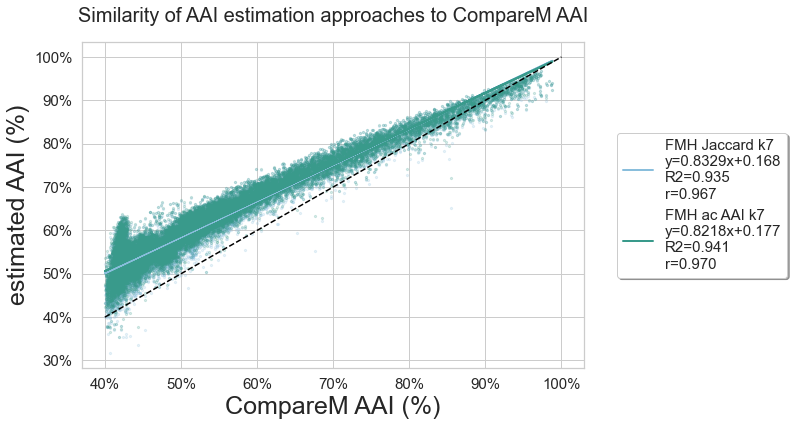

## Results

K-mer analysis methods enable similarity detection as low as a single shared k-mer between divergent genomes.
As a result, exact matching of long nucleotide k-mers can be used for taxonomic classification and similarity detection between closely related genomes, including strain-level, species-level, and genus-level comparisons (often using k-mer lengths 51, 31, and 21, respectively).
At larger evolutionary distances, accumulated nucleotide divergence limits the utility of exact nucleotide k-mer matching.
Protein sequences, which are more conserved than their corresponding nucleotide sequences, are the gold standard for comparisons at larger evolutionary distances.
Here, we evaluate the utility of amino acid k-mers for a wide range of genomic and metagenomic applications, including sequence distance estimation, taxonomic classification, and metagenome breakdown.

### Amino Acid k-mer length selection 

The Genome Taxonomy Database (GTDB) provides a genome-based taxonomy for bacterial and archaeal genomes [@doi:10.1038/s41587-020-0501-8]. 
We begin by assessing the prevalance of nucleotide amino acid k-mers of different k-mer lengths within genomes (/proteomes) selected for inclusion within GTDB.
The most recent GTDB release, `rs202`, encompasses 258,407 genomes from 47,895 species.

To make analyses at this scale tractable, we built `sourmash` FracMinHash sketches, with a scaling factor of 1000 for nucleotide k-mers (keep ~1/1000 k-mers) and 200 for amino acid k-mers (keep ~1/200 protein k-mers) [@doi:10.1101/2022.01.11.475838].
DNA FracMinHash sketches have been shown to accurately subsample genome datasets [@doi:10.1101/2022.01.11.475838].
For most genomes, both genomic and protein fastas were available for download from NCBI.
In remaining cases (n=36,632), genome fastas were translated into protein sequence via Prodigal [@doi:10.1186/1471-2105-11-119] prior to sketching.
We indexed these sketches into `sourmash` databases, which we have made available as part of the `Prepared Databases` section of the `sourmash` documentation, and archived on OSF [https://osf.io/t3fqa/] /Zenodo???.

For a range of nucleotide and amino acid k-mers lengths, we assessed the fraction of k-mers specific to each taxonomic rank.
For nucleotide k-mers, we used lengths of 21, 31, and 51, which are commonly used for analyses at the genus, species, and strain level, respectively. For amino acid k-mers, we focused on k-mer lengths ranging between k=7 and k=11, which roughly correspond to nucleotide k-mer lengths 21-31.
K-mers specific to a genome were only present in a single genome in the database; k-mers specific to a species were found in at least two genomes of the same species, etc. K-mers specific to a "superkingdom" were found in genomes from at least two phyla. 

For the GTDB-RS202 database, the majority of nucleotide k-mers are specific to (unique at) a specific genome, species, or genus. Few k-mers are shared across superkingdoms, though these do exist at a k-mer length of 21.
In contrast, all protein k-mer sizes contain a portion of k-mers that are shared across genera and above.
At a protein k-mer size of 7, over 80% of k-mers are present in genomes found in more than one phylum, while at a protein k-size of 10, the number of genome-specific k-mers is closer to that observed for nucleotide k-mers.
Given the difference in k-mers found across taxonomic ranks, we decided to focus on amino acid k-mer lengths 7 and 10 for our primary analyses.

This shared k-mers analysis is limited by the genomes included within GTDB. While some genera contain many thousands of genomes (e.g. 55k _Escherichia_ genomes), many others are limited to a single genome or pair of genomes. Thus here we do not consider the absolute numbers of shared k-mers, but rather the proportional differences between k-mer lengths.

<!---
NOTE: worth looking at k=17 /51???.
Also, go look at what ksizes are used in Mash Screen paper!!!
k=7 used by that db lookup paper (find)
--->

### Abridged GTDB Benchmarking Dataset

To rigorously assess the utility of protein k-mers for comparisons at an array of evolutionary distances, we selected a subset of GTDB genomes that would allow standardized comparisons across taxonomic ranks and overcome the database-inclusion limitations mentioned above.

For each genus with at least two species clusters in GTDB, one representative genome was randomly selected as an "anchor" genome.
Then, one additional genome was selected from the GTDB representative genomes matching the anchor's taxonomy at each higher taxonomic rank.
This "evolutionary path" consists of seven genomes: an anchor genome, a genome matching anchor taxonomy down to the genus level, one matching anchor taxonomy to the family level, one matching to the order level, and so on.
This creates a gradient of similarity, where comparisons to the anchor genome range from genus-level to superkingdom-level.

Path selection using the representative genomes in GTDB rs202 resulted in 4095 paths comprised of 9213 unique genomes (8790 Bacteria, 333 Archaea).
These paths include genome comparisons across 40 phyla (36 Bacteria, 4 Archaea), covering roughly a quarter of the 169 phyla (149 Bacteria, 20 Archaea) in GTDB release rs202.
While paths are limited to taxonomies with at least two GTDB representative genomes for each taxonomic rank, these paths provide a rich resource for comparisons at increasing evolutionary distances.

### Protein k-mers facilitate alignment-free comparisons at increased evolutionary distances

We begin by assessing standard k-mer comparisons across the 6 comparisons (each genome compared with the anchor genome) within each of 4095 evolutionary paths.
We estimate Jaccard Index (number of k-mers shared between two samples divided by the total number of k-mers across both samples) from FracMinHash sketches.
When plotted by the rank of the lowest common ancestor, the dynamic range of Jaccard values is much larger for protein k-mer comparisons. 
While DNA k-mers can provide resolution at the genus level, log-transformed jaccard values for protein k-mers continue to decrease, providing resolution for comparisons even between genomes in different phyla. We obtained similar results when comparing all available k-mers, suggesting FracMinHash sketching does not impact these results (_Supplemental Figure XX_).

**Question: Would a pair of heatmaps be better here? Or is there a better way to visualize this?**

### Distance estimation from FracMinHash sketch comparisons

Jaccard and Containment of DNA k-mers can be transformed into an estimate of the Average Nucleotide identity between genomes [cite Ondov Mash, Koslicki k-mer paper, koslicki scaled mh paper]. Recently, equations have been developed for FracMinHash that account for the nonindependence of mutated k-mers [@doi:10.1101/2022.01.11.475870]. Here we apply the FracMinHash distance estimation to protein k-mer comparisons to obtain an alignment-free estimate of Amino Acid Identity [@doi:10.1101/2022.01.11.475870]. We conduct these with all k-mers and using FracMinHash sketches using a default fractional scaling of 1/200 k-mers. In addition to these k-mer based AAI estimates, we also conducted alignment-based AAI methods for each comparison.
We include alignment comparisons with methods that leverage three different homology detection and alignment algorithms: _EzAAIb (BLAST)_, EzAAIm (MMSeqs2), and CompareM (DIAMOND). _As BLAST-based alignment remains the gold-standard method, we compare all AAI values the BLAST AAI values._ 
Note that FracMinHash sketches enable estimation of the Containment Index in addition to the more commonly used Jaccard Index. Unlike Jaccard comparisons, which estimate the similarity between sets, containment estimates are relative to each individual set. When both proteomes are equally trusted, the directional containment can be averaged, as done for BLAST-based AAI's(CITE?), which can differ depending on the direction of alignment. In contrast, when one set is highly trusted, such as a reference genome or proteome, the containment relative to that set may be most informative. FracMinHash AAI values produced by Jaccard and Containment (here, average containment) methods are very similar.

{#fig:evolpathsAAIvsCompareM height=4in}

<!---
To do: 
- finish ezAAI 1. mmseqs2 (running); 2. blast if possible!
- plot vs blast AAI (replace CompareM plot)
- better colors now that mc is gone
- plot scaled =1 ("jaccard," "avg containment") on same plot!?
--->

### Containment enables comparison directly from DNA sequence

For protein k-mer comparisons to be useful, any DNA queries must be translated into protein sequence. Often this limits amino acid comparisons to assembly-based workflows, as assemblies can be reliably translated into predicted Open Reading Frames (ORFs).
With k-mer methods, we can utilize direct 6-frame translation, which is assembly-free but does not attempt to find the correct open reading frame.
Assuming a single open reading frame, only ~1/6th of the k-mers generated by 6-frame translation will belong to true ORFs.
The remaining erroneous k-mers greatly impact the Jaccard Index (set similarity) when comparing samples.
However, these k-mers only impact the containment index in one direction (relative to the set with erroneous k-mers)
By using only the FracMinHash containment estimate relative to reference proteomes, we can obtain accurate Amino Acid Identity estimates directly from DNA sequence.
_We term this "anchor" containment, where the trusted genome is the "anchor" upon which we base the comparison._
Since 6-frame translation should always yield excess k-mers relative to genomes of similar size, this desired containment will generally be the larger of the two containment values (maximum containment).
Note that comparing two 6-frame translated datasets is not recommended, as there is no mechanism to exclude erroneous k-mers introduced during translation.

**figure: AAI from translated nucleotide --> reference protein**

<!---
to do, evolpaths:
  - comparison_genome vs anchor_proteome
  - sketch translate comparison genome
  - compare to anchor prot sketch
--->
### Protein k-mer containment can be used for taxonomic classification

Given that protein k-mers facilitate similarity estimation across these larger evolutionary distances, we next assess the utility of protein k-mers for taxonomic assignment, both for metagenome breakdown/classification and for assembled genomes.

#### Metagenome breakdown using protein k-mers

As developed in Irber et al., 2022 [@doi:10.1101/2022.01.11.475838], minimum set cover of nucleotide k-mers can be used to find the set of genomes that cover all known k-mers in your metagenome.
This approach, implemented in `sourmash gather`, works by using k-mer containment relative to reference genomes ("anchor containment", as above) and "assigning" metagenome k-mers iteratively to the reference genome with highest containment.
Anchor containment is then re-estimated using the remaining unassigned query k-mers until all known k-mers have been assigned.
This step provides us with an ordered list of reference genomes, each of which represent a non-overlapping portion of the metagenome.
The taxonomy of these matched reference genomes thus represents the closest match for each of these non-overlapping portions of the metagenome.
In addition to reporting these exact matches, we can aggregate these taxonomic assignments of these  matches to obtain taxonomic summarization at each rank.

Here, we assess the utility of protein k-mers for this application using the same metagenome samples described in Irber et al., 2022 [@doi:10.1101/2022.01.11.475838].
As metagenome samples are unassembled, we use the 6-frame translation approach described above to obtain protein k-mers for comparison.
No modification to the min-set-cov approach is required, as it already relies upon anchor containment to the reference genomes.

**figure: genome-grist mg breakdown, nucl k-mers, prot k-mers, nucl mapping**

_do we need an additional metagenome w/more divergent genomes, to show advantage of protein methods?_

<!---
to do:
  - [x] genome-grist gather paper metagenomes 
    - nucl space
    - prot space
    - compare recovery w/protein space
  - time comparison, gtdb-reps vs gtdb-all vs nucl genbank?
  - add more evolutionary distant metagenome?
  - compare the % of genome recovered with DNA, protein at diff ksizes.
  - DNA mapping vs prot k-mers
  - prot mapping vs prot k-mers
  - alt figure: genome-grist mg breakdown, prot k-mers, prot mapping

--->

#### Robust Taxonomic classification from protein k-mers

We use a similar approach for taxonomic classification of assembled genomes from protein k-mer containment. 
We apply the same minimum set cover approach to find the set of reference genomes that cover all known k-mers in our sample (in this case, a genome itself rather than a metagenome).
If the most contained reference genome is sufficiently similar (passes default or user-defined threshold) to our query, we can annotate the query with taxonomic information from this reference genome. 
If not, we can use the genome-based lowest common ancestor approach to classify the query genome to the taxonomic rank where it contains sufficient similarity to matched reference genome sequence. 

We select two sets of genomes: first, a set of 1000 genomes from the MGNify project ("MGNify-1000"), which are assembled from human gut and likely to be well-represented in existing databases.
We next choose a set of 885 microbial ("Delmont-885"; 820 _Bacteria_, 65 _Archaea_) metagenome-assembled genomes (MAGs) assembled from TARA Oceans metagenomes [@doi:10.1038/s41564-018-0176-9].
As the marine environment is understudied relative to human gut, these genomes are more challenging for classifiers as they are less likely to have close relatives available in reference databases.

To assess the utility of protein k-mers for genome classification, we conduct this classification using three k-mer approaches: direct nucleotide k-mers, 6-frame translated protein k-mers, and direct protein k-mers from prodigal-translated proteomes. Where reference taxnonomic lineages were available (MGNify-1000), we compared our results directly to these annotations. With experimental genomes where no reference taxonomic lineage is available, we assessed our annotation relative to `gtdb-tk` classification [@doi:10.1093/bioinformatics/btz848].

| Dataset  | Exact Match | Higher Rank| Unclassified (sourmash) | Unclassified (GTDB-Tk) |
|:-----------|------:|-------:|----------:|----------:|
| MGNify-1000| 95.7% | 4.3%   | N/A  | N/A |
| Delmont-885    | 73.5% | 26.5%  | 1 (0.1%) | 15 (1.7%) |

<!---
THIS USES BOTH THE 6-FRAME translation and sourmash tax!!! containment important, etc. I think this is the way to go.
to do:
- finish gather for MGNify, Delmont sets
- comparisons, k7, k10 vs gtdb-classify
- gtdb-all vs gtdb-reps (time, accuracy)
- add results for nucl vs 6-frame vs direct protein!
- text: explain min-set-cov <-> containment
--->

<!--compare heatmap w/ max containment for subset of gtdb data?-->
<!---
For , e.g. Pseudomonas, XX% of k-mers are 	shared within the chosen/published genomes within species. For all published genomes within the genus, a median of xx% of k-mers are shared between genomes of one species and genomes of the a different species in the same genus.

== median or mean containment at rank?
containent = % of a genome's k-mers that are shared
-- do using ALL of gtdb, BUT, start with just a single set of genomes.. e.g. Pseudomonas? == similar to "shared k-mers" paper [@doi:10.24072/pci.genomics.100001]

{#fig:evolpathsContain}
--->

<!---
### Lost Bits

** gtdb evolpaths (all k-mers)**
As the number of genomes per taxon varies widely across GTDB, comparisons across the entire GTDB database may be impacted by the particular genomes included in the database.
To minimize any database biases, we developed a randomized subset of the GTDB database to assess the utility of protein k-mers across a wide range of evolutionary distances.

[GTDB] This database provides a wide array of genomes for assessing the utility of protein k-mers for bacterial and archaeal similarity estimation and taxonomic classification.
Long dna k-mers ~~ short protein k-mers

while shorter dna k-mers might be shared across more sequence, you increase the risk for result in"shared, non-homologous k-mers" (k-mer homoplasy). A protein k-mer of length `10` coverse 30 base pairs in of nucleotide sequence 
Long nucleotide k-mers have already been shown to be useful for comparing genomes within the same genus or species.
For all DNA k-mer sizes, the majority of k-mers are present in only a single species, with only a few k-mers shared across genera.
Only at a dna k-mer size of 21 are a significant fraction of k-mers present in genomes shared across different families or even phyla.

{#fig:evolpathsANIAAI}

<!---
**For Evolpaths: WHY no multi-species representatives?**

{#fig:evolpathsAAIvsCompareM height=2in}

_We have generalized this type of comparison as the "maximum containment", which is the containment relative to the smaller set of k-mers. Since 6-frame translation should always yield excess k-mers relative to genomes of similar size, max containment will generally provide AAI comparisons of 6-frame translated k-mers to reference proteomes._
Since 6-frame translation should always yield excess k-mers relative to genomes of similar size, max containment will generally provide AAI comparisons of 6-frame translated k-mers to reference proteomes._

Anchor containment can also be used to enable robust taxonomic classification from either assembled proteomes or 6-frame translated DNA queries.

As implemented in `sourmash gather` [@doi:10.1101/2022.01.11.475838], this step provides us with a list of reference genomes in order of highest k-mer containment by our query.
--->
