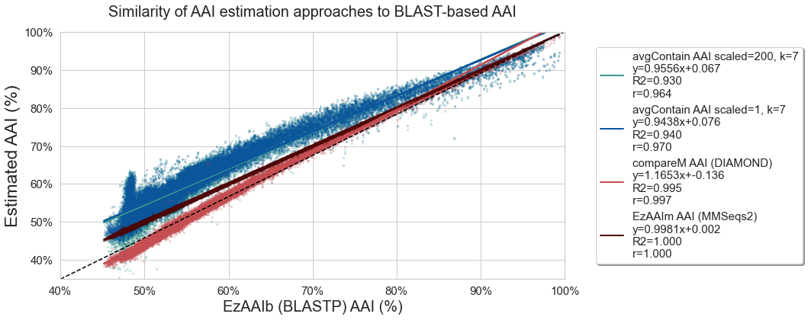

## Results

K-mer analysis methods enable similarity detection as low as a single shared k-mer between divergent genomes.
As a result, exact matching of long nucleotide k-mers can be used for taxonomic classification and similarity detection between closely related genomes, including strain-level, species-level, and genus-level comparisons (often using k-mer lengths 51, 31, and 21, respectively).
At larger evolutionary distances, accumulated nucleotide divergence limits the utility of exact nucleotide k-mer matching.
Amino acid k-mers (kaa-mers) retain the benefits of fast, alignment-free exact k-mer matching, but with increased tolerance for evolutionary divergence.
Here, we evaluate the utility of amino acid k-mers for a wide range of genomic and metagenomic applications, including sequence distance estimation and taxonomic classification.

### Amino Acid k-mers can be used to discriminate between taxa

The Genome Taxonomy Database (GTDB) provides a genome-based taxonomy for bacterial and archaeal genomes [@doi:10.1038/s41587-020-0501-8].
We begin by assessing the prevalance of nucleotide and amino acid k-mers of different k-mer lengths within assemblies selected for inclusion within GTDB.
GTDB release `rs202` encompasses 258,407 genomes from 47,895 species.

To make analyses at this scale tractable, we use FracMinHash sketching to randomly subsample all available k-mers, retaining approximately (\~1/1000 nucleotide k-mers) and \~1/200 amino acid k-mers) [@doi:10.1101/2022.01.11.475838].
DNA FracMinHash sketches have been shown to accurately subsample genome datasets [@doi:10.1101/2022.01.11.475838].
For most genomes, both genomic and protein fastas were available for download from NCBI.
In remaining cases (n=36,632), genome fastas were translated into protein sequence via Prodigal [@doi:10.1186/1471-2105-11-119] prior to sketching.
We indexed these sketches into `sourmash` databases, which we have made available as part of the `Prepared Databases` section of the `sourmash` documentation, and archived on OSF [https://osf.io/t3fqa/] /Zenodo???.

For a range of nucleotide and amino acid k-mers lengths, we assessed the fraction of k-mers specific to each taxonomic rank.
For nucleotide k-mers, we used lengths of 21, 31, and 51, which are commonly used for analyses at the genus, species, and strain level, respectively. For amino acid k-mers, we focused on k-mer lengths ranging between k=7 and k=11, which roughly correspond to nucleotide k-mer lengths 21-31.
K-mers specific to a genome were only present in a single genome in the database; k-mers specific to a species were found in at least two genomes of the same species, etc. K-mers specific to a superkingdom were found in genomes/proteomes from at least two phyla.

For the GTDB-RS202 database, the majority of nucleotide k-mers are specific to (unique at) a specific genome, species, or genus. Few k-mers are shared across superkingdoms, though these do exist at a k-mer length of 21.
In contrast, all protein k-mer sizes contain a portion of k-mers that are shared across genera and above.
At a protein k-mer size of 7, over 80% of k-mers are present in genomes found in more than one phylum, while at a protein k-size of 10, the number of genome-specific k-mers is closer to that observed for nucleotide k-mers.
The differences observed between nucleotide and amino acid k-mers, as well as across different k-mer lengths suggests that these different k-mer sizes may provide resolution at different taxonomic ranks.
We choose amino acid k-mer lengths 7 and 10 for our primary analyses, and have set a default kaa-mer length of 10 within `sourmash`.

<!---
NOTE: worth looking at k=17 /51???.
k=9 Mash Screen translated screen
k=7 used by KAA-mer
--->

### Evolutionary Paths Dataset

To rigorously assess the utility of protein k-mers for comparisons at an array of evolutionary distances, we selected a subset of GTDB genomes that would allow standardized comparisons across taxonomic ranks and overcome the database-inclusion limitations mentioned above.

For each genus with at least two species clusters in GTDB, one representative genome was randomly selected as an "anchor" genome.
Then, one additional genome was selected from the GTDB representative genomes matching the anchor's taxonomy at each higher taxonomic rank.
This "evolutionary path" consists of seven genomes: an anchor genome, a genome matching anchor taxonomy down to the genus level, one matching anchor taxonomy to the family level, one matching to the order level, and so on.
This creates a gradient of similarity, where comparisons to the anchor genome range from genus-level to superkingdom-level.

Path selection using the representative genomes in GTDB rs202 resulted in 4095 paths comprised of 9213 unique genomes (8790 Bacteria, 333 Archaea).
These paths include genome comparisons across 40 phyla (36 Bacteria, 4 Archaea), covering roughly a quarter of the 169 phyla (149 Bacteria, 20 Archaea) in GTDB release rs202.
While paths are limited to taxonomies with at least two GTDB representative genomes for each taxonomic rank, these paths provide a rich resource for comparisons at increasing evolutionary distances.

For DNA comparisons, each genome was sketched from the available genome downloaded from genbank.
For protein comparisons, we conducted both protein comparisons and translated comparisons.
In both workflows, all anchor genomes were sketched from available proteomes (either downloaded or generated via Prodigal, as above).
For the direct protein assessment, comparison proteomes were also sketched from the available proteome.
For these sketches, k-mer containment results are equally valid in both directions, so we report the mean containment for the comparison alongside the Jaccard Index.
For the second workflow, comparison genomes were 6-frame translated to build protein kaa-mers.
As 6-frame translation introduces erroneous k-mers, we report only the containment estimate relative to the anchor proteome.
We term this "anchor containment", where the trusted genome is the "anchor" upon which we base the comparison.
We conduct k-mer comparisons using `sourmash` FracMinHash sketches default fractional scaling: 1/1000 k-mers from DNA sketches and 1/200 k-mers for protein sketches (including 6-frame translated sketches).
For amino acid k-mers, we focus on k-mer lengths k=7 and k=10, which are closest to nucleotide k-mer lengths 21 and 31.
To verify results and estimate the impact of FracMinHash scaling, we also conducted all comparisons using all available k-mers (no subsampling).

### Protein k-mers facilitate alignment-free comparisons at increased evolutionary distances

We begin by assessing k-mer containment across the 6 comparisons (each genome compared with the anchor genome) within each of 4095 evolutionary paths.
When plotted by the rank of the lowest common ancestor, the dynamic range of containment values is much larger for kaa-mer comparisons.
While DNA k-mers can provide resolution at the genus level, log-transformed containment values for protein k-mers continue to decrease, providing resolution for comparisons even between genomes of different phyla.
Average containment estimated from proteome sequence is very similar to anchor containment estimated from 6-frame translation of genome sequence, suggesting that either value can be used for this type of comparison.
We obtained similar results when comparing all available k-mers, suggesting that these results are not affected by FracMinHash scaling (_Supplemental Figure XX_).

{#fig:evolpathsAAIvsCompareM height=4in}

<!---
**To do:**
- add results from 6-frame translated sketches as dotted lines ridges with lighter fill?? (protein only)
--->

### FracMinHash kaa-mer containment accurately estimates sequence similarity

Pairwise Overall Genome Relatedness indices (OGRI's) such as Average Nucleotide Identity (ANI) and its protein counterpart, Average Amino Acid Identity (AAI) have shown lasting utility for genome relatedness and phylogenomic analysis.
Traditional ANI and AAI describe the sequence similarity of all orthologous genes, either in nucleotide or protein space, respectively.
Both have been shown to be robust measures of overall pairwise genome relatedness even for highly incomplete datasets, such as those comprised of only ~4% of the genome or 100 genes [@doi:10.1128/AEM.01398-06; @doi:10.1038/ismej.2017.113].
These measures have utility for phylogenomic comparisons and taxonomic classification, but alignment-based analyses not tractable for large-scale comparisons.

As first noted by [@fan_AAF] and extended for MinHash [@mash], DNA k-mer comparisons can be used to estimate the sequence similarity between two genomes without alignment.
These methods have primarily assumed a simple mutational model of random nucleotide substitution in order to estimate sequence identity from the Jaccard Index between the two samples.
While this strategy permits ANI estimation at the scale of whole-databases, they work best with high quality genomes with high similarity (>90% ANI) [@doi:10.1186/s13059-016-0997-x; @doi:10.1186/s13059-019-1841-x; @doi:10.1038/s41467-018-07641-9].
Compared with Jaccard, the Containment Index permits more accurate estimation of genomic distance, particularly for genomes of very different lengths [@koslicki_containment; @dashing; @mash_screen].
As described [@dk_fracminhash], using the Fractional Containment Index ${C_\text{frac}(A,B)}$, estimated using a k-mer size of $k$, we can obtain a point estimate of sequence identity between two genomes as follows:

$ANI = {C_\text{frac}(A,B)}^{1/k}$

Note that this method assumes a simple mutational model of random substitution and estimates sequence divergence solely using the fraction of shared and divergent k-mers between the two FracMinhash sketches.
When FracMinhash sketches are instead generated with amino acid k~aa~-mers of length $k~aa~$, the same equation can be used to generate alignment-free AAI estimates.

$AAI = {C_\text{frac}(A,B)}^{1/k~aa~}$

To account for the variance of FracMinHash subsampling, we also derive confidence intervals around this point estimate (see Methods for details).

<!---
The Jaccard Index from DNA k-mer comparisons is commonly used to estimate of the sequence similarity between genomes, often as transformed into
Recently, equations have been developed for FracMinHash Containment that estimate sequence similarity while accounting for the nonindependence of mutated k-mers [@doi:10.1101/2022.01.11.475870].
For two genomes, these equations assume a simple mutational model of random nucleotide substitution, and estimate nucleotide divergence solely using the fraction of shared and divergent k-mers between the two genomes.

Here, we apply FracMinHash distance estimation to protein k-mers to obtain an alignment-free estimate of Amino Acid Identity.
--->

To assess the accuracy and utility of k~aa~-mer Amino Acid Identity estimation, we compared our results with alignment-based methods that leverage three different algorithms: EzAAIb (BLASTp), EzAAIm (MMSeqs2), and CompareM(DIAMOND). As BLAST-based alignment remains the gold-standard method, we compare all AAI values to the BLAST AAI values.
As above, we utilize anchor containment for comparisons involving 6-frame translated sketches.

{#fig:evolpathsAAIvsBLAST-AAI}

<!---
**To do:**
- Rerun BLAST-AAI with default thresholds (current was lower identity thresholds) and re-plot
- finish and add results from 6-frame translated sketches (anchor containment): same plot? or adjacent plot if needed.
--->

### Protein k-mer containment and AAI can be used for taxonomic classification

Given that protein k-mers facilitate similarity estimation across these larger evolutionary distances, we next assess the utility of protein k-mers for taxonomic assignment, both for metagenome breakdown/classification and for assembled genomes.

#### Metagenome breakdown using protein k-mers

As developed in Irber et al., 2022 [@doi:10.1101/2022.01.11.475838], minimum set cover of nucleotide k-mers can be used to find the set of genomes that cover all known k-mers in a metagenome.
This approach, implemented in `sourmash gather`, works by using k-mer containment relative to reference genomes ("anchor containment", as above) and "assigning" metagenome k-mers iteratively to the reference genome with highest containment.
Anchor containment is then re-estimated using the remaining unassigned query k-mers until all known k-mers have been assigned.
This step provides us with an ordered list of reference genomes, each of which represent a non-overlapping portion of the metagenome.
The taxonomy of these matched reference genomes thus represents the closest match for each of these non-overlapping portions of the metagenome.
In addition to reporting these exact matches, we can aggregate these taxonomic assignments of these  matches to obtain taxonomic summarization at each rank.

Here, we assess the utility of protein k-mers for this application using the same metagenome samples described in Irber et al., 2022 [@doi:10.1101/2022.01.11.475838].
As metagenome samples are unassembled, we use the 6-frame translation approach described above to obtain protein k-mers for comparison.
No modification to the min-set-cov approach is required, as it already relies upon anchor containment to the reference genomes.

**add figure: genome-grist mg breakdown, nucl k-mers, prot k-mers, nucl mapping**

_do we need an additional metagenome w/more divergent genomes, to show advantage of protein methods?_

<!---
to do:
  - [x] genome-grist gather paper metagenomes 
    - nucl space
    - prot space
    - compare recovery w/protein space
  - time comparison, gtdb-reps vs gtdb-all vs nucl genbank?
  - add more evolutionary distant metagenome?
  - compare the % of genome recovered with DNA, protein at diff ksizes.
  - DNA mapping vs prot k-mers
  - prot mapping vs prot k-mers
  - alt figure: genome-grist mg breakdown, prot k-mers, prot mapping

--->

#### Robust taxonomic classification from protein k-mers

We use a similar approach for taxonomic classification of assembled genomes from protein k-mer containment.
We apply the same minimum set cover approach to find the set of reference genomes that cover all known k-mers in our sample (in this case, a genome itself rather than a metagenome).
If the most contained reference genome is sufficiently similar (passes default or user-defined threshold) to our query, we can annotate the query with taxonomic information from this reference genome.
If not, we can use the genome-based lowest common ancestor approach to classify the query genome to the taxonomic rank where it contains sufficient similarity to matched reference genome sequence.

We select two sets of genomes: first, a set of 1000 genomes from the MGNify project ("MGNify-1000"), which are assembled from human gut and likely to be well-represented in existing databases.
We next choose a set of 885 microbial ("Delmont-885"; 820 _Bacteria_, 65 _Archaea_) metagenome-assembled genomes (MAGs) assembled from TARA Oceans metagenomes [@doi:10.1038/s41564-018-0176-9].
As the marine environment is understudied relative to human gut, these genomes are more challenging for classifiers as they are less likely to have close relatives available in reference databases.

To assess the utility of protein k-mers for genome classification, we conduct this classification using three k-mer approaches: direct nucleotide k-mers, 6-frame translated protein k-mers, and direct protein k-mers from prodigal-translated proteomes. Where reference taxnonomic lineages were available (MGNify-1000), we compared our results directly to these annotations. With experimental genomes where no reference taxonomic lineage is available, we assessed our annotation relative to `gtdb-tk` classification [@doi:10.1093/bioinformatics/btz848].

| Dataset  | Exact Match | Higher Rank| Unclassified (sourmash) | Unclassified (GTDB-Tk) |
|:-----------|------:|-------:|----------:|----------:|
| MGNify-1000| 95.7% | 4.3%   | N/A  | N/A |
| Delmont-885    | 73.5% | 26.5%  | 1 (0.1%) | 15 (1.7%) |

to do:
- discuss/utilize AAI threshold at all?

### Notes

Include Jaccard --> AAI results anywhere? 
- FracMinHash AAI values produced by Jaccard and Containment (here, average containment) methods are very similar.

<!---
to do:
- finish gather for MGNify, Delmont sets
- comparisons, k7, k10 vs gtdb-classify
- gtdb-all vs gtdb-reps (time, accuracy)
- add results for nucl vs 6-frame vs direct protein!
- text: explain min-set-cov <-> containment
--->

<!---
For , e.g. Pseudomonas, XX% of k-mers are 	shared within the chosen/published genomes within species. For all published genomes within the genus, a median of xx% of k-mers are shared between genomes of one species and genomes of the a different species in the same genus.

== median or mean containment at rank?
containent = % of a genome's k-mers that are shared
-- do using ALL of gtdb, BUT, start with just a single set of genomes.. e.g. Pseudomonas? == similar to "shared k-mers" paper [@doi:10.24072/pci.genomics.100001]

{#fig:evolpathsContain}
--->

<!---
### Lost Bits
Protein sequences, which are more conserved than their corresponding nucleotide sequences, are the gold standard for comparisons at larger evolutionary distances.

** gtdb evolpaths (all k-mers)**
As the number of genomes per taxon varies widely across GTDB, comparisons across the entire GTDB database may be impacted by the particular genomes included in the database.
To minimize any database biases, we developed a randomized subset of the GTDB database to assess the utility of protein k-mers across a wide range of evolutionary distances.

[GTDB] This database provides a wide array of genomes for assessing the utility of protein k-mers for bacterial and archaeal similarity estimation and taxonomic classification.
Long dna k-mers ~~ short protein k-mers

while shorter dna k-mers might be shared across more sequence, you increase the risk for result in"shared, non-homologous k-mers" (k-mer homoplasy). A protein k-mer of length `10` coverse 30 base pairs in of nucleotide sequence 
Long nucleotide k-mers have already been shown to be useful for comparing genomes within the same genus or species.
For all DNA k-mer sizes, the majority of k-mers are present in only a single species, with only a few k-mers shared across genera.
Only at a dna k-mer size of 21 are a significant fraction of k-mers present in genomes shared across different families or even phyla.

{#fig:evolpathsANIAAI}

<!---
**For Evolpaths: WHY no multi-species representatives?**

{#fig:evolpathsAAIvsCompareM height=2in}

_We have generalized this type of comparison as the "maximum containment", which is the containment relative to the smaller set of k-mers. Since 6-frame translation should always yield excess k-mers relative to genomes of similar size, max containment will generally provide AAI comparisons of 6-frame translated k-mers to reference proteomes._
Since 6-frame translation should always yield excess k-mers relative to genomes of similar size, max containment will generally provide AAI comparisons of 6-frame translated k-mers to reference proteomes._

Anchor containment can also be used to enable robust taxonomic classification from either assembled proteomes or 6-frame translated DNA queries.

As implemented in `sourmash gather` [@doi:10.1101/2022.01.11.475838], this step provides us with a list of reference genomes in order of highest k-mer containment by our query.
Jaccard ...(number of k-mers shared between two samples divided by the total number of k-mers across both samples) and the Containment index ()from FracMinHash sketches.

**Questions:**
- Also display jaccard for protein sketch comparisons?
- Is there a better way to visualize this?
  - a pair of heatmaps?

### Unique Amino acid k-mers correlate with proteome size

The number of unique amino acid k-mers is consistently correlated with the number of genes per genome.
(scaled 100, protein k10)
{#fig:all_pw_fig height=3in}

**to do**: 
- re-do with evolpaths genomes; + make scaled=1 version?

--->
