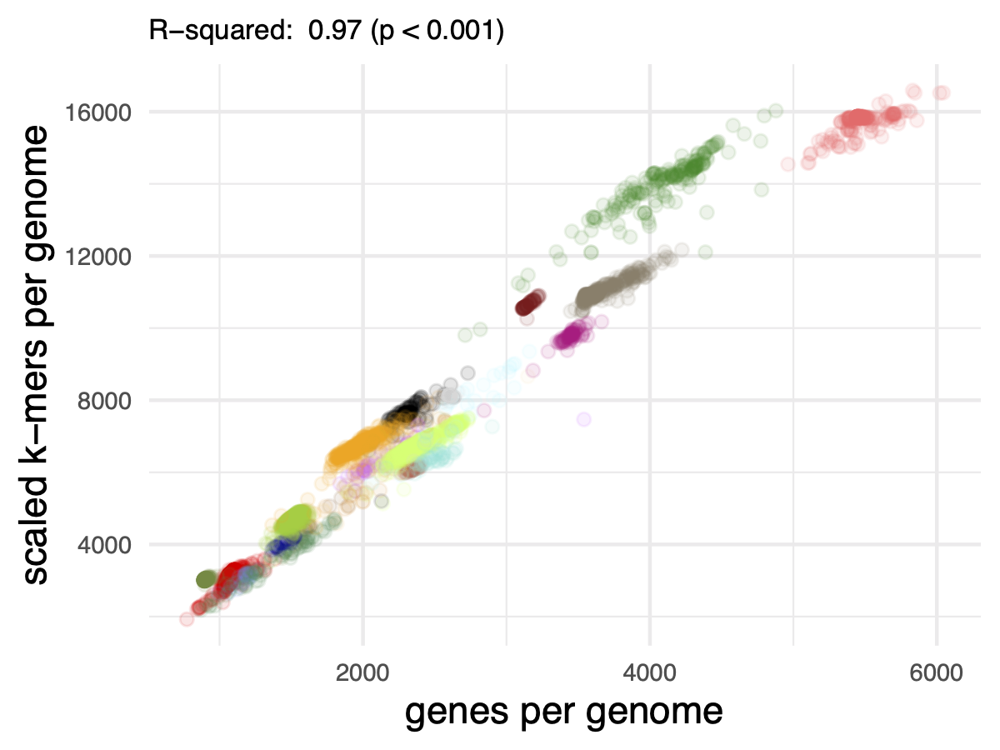

---
title: Protein k-mer analyses for assembly- and alignment-free sequence analysis
keywords:
- metagenomics
- AAI
- Alignment-free
- Assembly-free
- MinHash
- FracMinHash
- Containment
lang: en-US
date-meta: '2022-06-10'
author-meta:
- N. Tessa Pierce-Ward
- Taylor E. Reiter
- C. Titus Brown
header-includes: |-
  <!--
  Manubot generated metadata rendered from header-includes-template.html.
  Suggest improvements at https://github.com/manubot/manubot/blob/main/manubot/process/header-includes-template.html
  -->
  <meta name="dc.format" content="text/html" />
  <meta name="dc.title" content="Protein k-mer analyses for assembly- and alignment-free sequence analysis" />
  <meta name="citation_title" content="Protein k-mer analyses for assembly- and alignment-free sequence analysis" />
  <meta property="og:title" content="Protein k-mer analyses for assembly- and alignment-free sequence analysis" />
  <meta property="twitter:title" content="Protein k-mer analyses for assembly- and alignment-free sequence analysis" />
  <meta name="dc.date" content="2022-06-10" />
  <meta name="citation_publication_date" content="2022-06-10" />
  <meta name="dc.language" content="en-US" />
  <meta name="citation_language" content="en-US" />
  <meta name="dc.relation.ispartof" content="Manubot" />
  <meta name="dc.publisher" content="Manubot" />
  <meta name="citation_journal_title" content="Manubot" />
  <meta name="citation_technical_report_institution" content="Manubot" />
  <meta name="citation_author" content="N. Tessa Pierce-Ward" />
  <meta name="citation_author_institution" content="Department of Population Health and Reproduction, University of California, Davis" />
  <meta name="citation_author_orcid" content="0000-0002-2942-5331" />
  <meta name="twitter:creator" content="@saltyscientist" />
  <meta name="citation_author" content="Taylor E. Reiter" />
  <meta name="citation_author_institution" content="Department of Population Health and Reproduction, University of California, Davis" />
  <meta name="citation_author_orcid" content="0000-0002-7388-421X" />
  <meta name="twitter:creator" content="@ReiterTaylor" />
  <meta name="citation_author" content="C. Titus Brown" />
  <meta name="citation_author_institution" content="Department of Population Health and Reproduction, University of California, Davis" />
  <meta name="citation_author_orcid" content="0000-0001-6001-2677" />
  <meta name="twitter:creator" content="@ctitusbrown" />
  <link rel="canonical" href="https://bluegenes.github.io/2022-paper-protein-kmers/" />
  <meta property="og:url" content="https://bluegenes.github.io/2022-paper-protein-kmers/" />
  <meta property="twitter:url" content="https://bluegenes.github.io/2022-paper-protein-kmers/" />
  <meta name="citation_fulltext_html_url" content="https://bluegenes.github.io/2022-paper-protein-kmers/" />
  <meta name="citation_pdf_url" content="https://bluegenes.github.io/2022-paper-protein-kmers/manuscript.pdf" />
  <link rel="alternate" type="application/pdf" href="https://bluegenes.github.io/2022-paper-protein-kmers/manuscript.pdf" />
  <link rel="alternate" type="text/html" href="https://bluegenes.github.io/2022-paper-protein-kmers/v/576c7bf24786dfb4591f956d93cc6f990aaf9443/" />
  <meta name="manubot_html_url_versioned" content="https://bluegenes.github.io/2022-paper-protein-kmers/v/576c7bf24786dfb4591f956d93cc6f990aaf9443/" />
  <meta name="manubot_pdf_url_versioned" content="https://bluegenes.github.io/2022-paper-protein-kmers/v/576c7bf24786dfb4591f956d93cc6f990aaf9443/manuscript.pdf" />
  <meta property="og:type" content="article" />
  <meta property="twitter:card" content="summary_large_image" />
  <link rel="icon" type="image/png" sizes="192x192" href="https://manubot.org/favicon-192x192.png" />
  <link rel="mask-icon" href="https://manubot.org/safari-pinned-tab.svg" color="#ad1457" />
  <meta name="theme-color" content="#ad1457" />
  <!-- end Manubot generated metadata -->
bibliography:
- content/manual-references.json
manubot-output-bibliography: output/references.json
manubot-output-citekeys: output/citations.tsv
manubot-requests-cache-path: ci/cache/requests-cache
manubot-clear-requests-cache: false
...


<small><em>
This manuscript
([permalink](https://bluegenes.github.io/2022-paper-protein-kmers/v/576c7bf24786dfb4591f956d93cc6f990aaf9443/))
was automatically generated
from [bluegenes/2022-paper-protein-kmers@576c7bf](https://github.com/bluegenes/2022-paper-protein-kmers/tree/576c7bf24786dfb4591f956d93cc6f990aaf9443)
on June 10, 2022.
</em></small>

## Authors


+ **N. Tessa Pierce-Ward**<br>
    {.inline_icon width=16 height=16}
    [0000-0002-2942-5331](https://orcid.org/0000-0002-2942-5331)
    · {.inline_icon width=16 height=16}
    [bluegenes](https://github.com/bluegenes)
    · {.inline_icon width=16 height=16}
    [saltyscientist](https://twitter.com/saltyscientist)<br>
  <small>
     Department of Population Health and Reproduction, University of California, Davis
     · Funded by NSF 1711984, NSF 2018911
  </small>

+ **Taylor E. Reiter**<br>
    {.inline_icon width=16 height=16}
    [0000-0002-7388-421X](https://orcid.org/0000-0002-7388-421X)
    · {.inline_icon width=16 height=16}
    [taylorreiter](https://github.com/taylorreiter)
    · {.inline_icon width=16 height=16}
    [ReiterTaylor](https://twitter.com/ReiterTaylor)<br>
  <small>
     Department of Population Health and Reproduction, University of California, Davis
     · Funded by Grant XXXXXXXX
  </small>

+ **C. Titus Brown**<br>
    {.inline_icon width=16 height=16}
    [0000-0001-6001-2677](https://orcid.org/0000-0001-6001-2677)
    · {.inline_icon width=16 height=16}
    [ctb](https://github.com/ctb)
    · {.inline_icon width=16 height=16}
    [ctitusbrown](https://twitter.com/ctitusbrown)<br>
  <small>
     Department of Population Health and Reproduction, University of California, Davis
     · Funded by Moore Foundation GBMF4551
  </small>


## Abstract {.page_break_before}


## Background

Advancements in sequencing over the past decades have made it feasible to investigate the vast global diversity of microbial organisms via direct sequencing of environmental samples (metagenomics). These techniques have expanded and reshaped our understanding of evolutionary relatedness across the tree of life and allowed us to move beyond organismal isolates to investigate the structure and function of microbial communities (CITE).

Metagenomic analyses rely on our ability to make sense of bulk sequencing reads by assigning taxonomic and functional groupings.
However, the methods and databases used for characterization impact both the extent and accuracy of classification.
As the scale of genomic sequencing continues to grow, fast and low-memory methods for estimating sequence similarity have become critical for conducting tasks ranging from taxonomic classification to phylogenetic analysis on large-scale datasets [@mash; @kraken2].
However, many of these methods struggle with classification specificity, with some methods reporting false positive rates as high as 25% on short read metagenomic datasets prior to thresholding [@portik_tax].
At the same time, classification techniques often can suffer from limited sensitivity when comparing highly polymorphic sequences or classifying organisms from groups underrepresented in reference databases.
For understudied and diverse habitats such as soil, metagenomic classification methods often only categorize a small fraction of metagenomic data, and even well-studied environments such as the human gut can produce significant uncharacterized metagenome content (CITE).

As protein sequence is more conserved than the underlying DNA sequence, protein-based comparisons have long been the gold-standard approach across larger evolutionary distances [@blast; @diamond].
Protein-based metagenomics taxonomic classification approaches typically have increased sensitivity relative to nucleotide methods [@breit_classif; @mmseqs_tax; @catbat; @meganlr; @kaiju; @mash_screen].
Whole-proteome relatedness indices such as Amino Acid Identity (AAI) can be used to determine whether uncharacterized sequences belong to known taxonomic groups or represent truly novel sequence.
As we continue to sequence more of the biosphere, there remains a need for fast and accurate alignment-free sequence comparison tools with protein-level sensitivity.

Alignment-free methods using k-mers, short sequences of length k, can quickly compare and classify metagenomic datasets particularly when used with subsampling methods such as MinHash [@mash] and FracMinHash [@sourmash_gather].
While the majority of k-mer methods utilize nucleotide k-mers, amino acid k-mers (k~aa~-mers) have shown some promise for functional screening and annotation [@mash_screen; @kaamer; @ob_orpheum].
Here, we show that k~aa~-mer comparisons robustly estimate Average Amino Acid Identity across large evolutionary distances, even while using FracMinHash k-mer subsampling methods.
We then use FracMinHash k~aa~mer sketches to tackle two classification challenges: taxonomic classification of assembled genomes, and compositional analysis of metagenomes.
Our results suggest that k~aa~mer sequence analysis can facilitate large-scale assembly-based and assembly-free metagenomic analyses, even when sequenced organisms are only distantly related to organisms available in reference databases.


<!---
We demonstrate that FracMinHash Containment estimates can robustly estimate Average Amino Acid Identity across a range of evolutionary distances.
We use FracMinhash subsampling to facilitate conducting these comparisons at scale [@sourmash_gather].
, including Average Amino Acid Identity (AAI) estimation and taxonomic classification.
Metagenomic classification methods often only categorize a small fraction of metagenomic data from understudied and diverse habitats such as soil, and even well-studied environments such as human gut can produce significant uncharacterized metagenome content.
**Taxonomic Classification -- current approaches + issues**
Using these protein FracMinHashes with protein containment searches, we can conduct taxonomic classification on both assembled genomes and raw metagenome samples.
Recently, [@sourmash_gather] leveraged containment analysis with a "minimum metagenome cover" approach to find the best set of reference genomes that cover the metagenome sequence.
Here, we use this minimum set cover approach with protein FracMinHash to directly classify raw metagenome reads and to classify assembled genomes/proteomes.
..discuss min-set-cov /gather

BLASTX-style classification -- proteins increase sensitivity.
- Kaiju[@doi:10.1038/ncomms11257] uses protein-level metagenomic classification using 6-frame translation, though Kaiju uses a seed-extend approach to generate protein alignments (minimum match length 11aa), rather than a purely k-mer based approach.
- sensitivity/specificity tradeoff -- longer matches (minimum match length 11 instead of 12 for MEM yielded larger gains in sensitivity for a relatively small(er) loss in precision).
- MEGAN-Prot (uses DIAMOND) [@doi:10.1002/cpz1.59] uses a BLASTX style approach
- review incl. protein methods [@doi:10.1093/bib/bbx120]

struggle on both fronts -- too much data, still many things that are far from reference sequences

While many methods provide a annotations linked to individual sequencing reads, in many cases, researchers are 
#### Notes
While ANI has emerged as the most widely-accepted method for delimiting species boundaries, AAI thresholds have been proposed for distinguishing higher taxonomic ranks [@genomic_std; @doi:10.1016/j.mib.2007.08.006; @doi:10.1038/ismej.2017.113].
- AAI::phylogeny https://www.ncbi.nlm.nih.gov/pmc/articles/PMC1236649/
Unused
Alignment-based estimates can fail at larger evolutionary distances.
 rRNA amplicon surveys may underestimate bacterial diversity [@doi:10.1128/AEM.00014-18].

 , using genomes within the GTDB taxonomy as benchmarking test set.

We extend FracMinHash distance estimation to protein k-mers and demonstrate distance estimation across related genomes using the GTDB taxonomy.
FracMinHash containment estimates work well for genome pairs of varying lengths and for compositional analysis of metagenome samples.

FracMinHash sketches can be used for robust assembly and alignment-free pairwise relatedness estimation that can be used on sequences separated by a wide range of evolutionary distances.

Here, we demonstrate that the utility of FracMinHash protein containment, both used directly and a an approximation of ANI and AAI, for taxonomic classification and phylogenomic reconstruction for species across the tree of life.

--->


## Results

K-mer analysis methods enable similarity detection as low as a single shared k-mer between divergent genomes.
As a result, exact matching of long nucleotide k-mers has been used for taxonomic classification and similarity detection between closely related genomes (genus-level to strain-level comparisons using k-mer lengths between 21-51) [@mash; @metapalette].
At larger evolutionary distances, accumulated nucleotide divergence limits the utility of exact nucleotide k-mer matching.
Amino acid k-mers (kaa-mers) retain the benefits of fast, alignment-free exact k-mer matching, but with increased tolerance for evolutionary divergence.
Here, we evaluate the utility of amino acid k-mers for a wide range of genomic and metagenomic applications, including sequence distance estimation and taxonomic classification.

### Amino Acid k-mers can be used to discriminate between taxa

The Genome Taxonomy Database (GTDB) provides a genome-similarity-based taxonomy for bacterial and archaeal genomes [@doi:10.1038/s41587-020-0501-8].
GTDB release `rs202` encompasses 258,407 genomes from 47,895 species.
We begin by assessing the prevalance of nucleotide and amino acid k-mers of different k-mer lengths within assemblies included in GTDB.

To make analyses at this scale tractable, we use FracMinHash sketching to randomly subsample all available k-mers, retaining approximately 1/1000 nucleotide k-mers and 1/200 amino acid k-mers [@doi:10.1101/2022.01.11.475838].
DNA FracMinHash sketches have been shown to representatively subsample genome datasets [@doi:10.1101/2022.01.11.475838].
For most genomes, both genomic and protein fastas were available for download from NCBI.
In remaining cases (n=36,632), genome fastas were translated into protein sequence via Prodigal [@doi:10.1186/1471-2105-11-119] prior to sketching.
We indexed these sketches into `sourmash` databases, which we have made available as part of the `Prepared Databases` section of the `sourmash` documentation, and archived on OSF [https://osf.io/t3fqa/] /Zenodo???.

For a range of nucleotide and amino acid k-mers lengths, we assessed the fraction of k-mers specific to each taxonomic rank.
For nucleotide k-mers, we used lengths of 21, 31, and 51, which are commonly used for analyses at the genus, species, and strain level, respectively. For amino acid k-mers, we focused on k-mer lengths ranging between k=7 and k=11, which roughly correspond to nucleotide k-mer lengths 21-31.
K-mers specific to a genome were only present in a single genome in the database; k-mers specific to a species were found in at least two genomes of the same species, etc. K-mers specific to a superkingdom were found in genomes/proteomes from at least two phyla.


For the GTDB-RS202 database, the majority of nucleotide k-mers are specific to (unique at) a specific genome, species, or genus. Few k-mers are shared across superkingdoms, though these do exist at a k-mer length of 21.
In contrast, all protein k-mer sizes contain a portion of k-mers that are shared across genera and above.
At a protein k-mer size of 7, over 80% of k-mers are present in genomes found in more than one phylum, while at a protein k-size of 10, the number of genome-specific k-mers is closer to that observed for nucleotide k-mers.
The differences observed between nucleotide and amino acid k-mers, as well as across different k-mer lengths suggests that these different k-mer sizes may provide resolution (CTB: do we want to say specificity here?) at different taxonomic ranks.
We choose amino acid k-mer lengths 7 and 10 for our primary analyses, and have set a default kaa-mer length of 10 within `sourmash`.

<!---
NOTE: worth looking at k=17 /51???.
k=9 Mash Screen translated screen
k=7 used by KAA-mer
--->

### Evolutionary Paths Dataset

To rigorously assess the utility of protein k-mers for comparisons at an array of evolutionary distances, we selected a subset of GTDB genomes that would allow standardized comparisons across taxonomic ranks and overcome the database-inclusion limitations mentioned above.

For each genus with at least two species clusters in GTDB, one representative genome was randomly selected as an "anchor" genome.
Then, one additional genome was selected from the GTDB representative genomes matching the anchor's taxonomy at each higher taxonomic rank.
This "evolutionary path" consists of seven genomes: an anchor genome, a genome matching anchor taxonomy down to the genus level, one matching anchor taxonomy to the family level, one matching to the order level, and so on.
This creates a gradient of similarity from genus to superkingdom.

Path selection using the representative genomes in GTDB rs202 resulted in 4095 paths comprised of 9213 unique genomes (8790 Bacteria, 333 Archaea).
These paths include genome comparisons across 40 phyla (36 Bacteria, 4 Archaea), covering roughly a quarter of the 169 phyla (149 Bacteria, 20 Archaea) in GTDB release rs202.
While paths are limited to taxonomies with at least two GTDB representative genomes for each taxonomic rank, these paths provide a rich resource for comparisons at increasing evolutionary distances.

For DNA comparisons, each genome was sketched from the available genome downloaded from genbank.
For protein comparisons, we conducted both protein comparisons and translated comparisons.
In both workflows, all anchor genomes were sketched from available proteomes (either downloaded or generated via Prodigal, as above).
For the direct protein assessment, comparison proteomes were also sketched from the available proteome.
For these sketches, k-mer containment results are equally valid in both directions, so we report the mean containment for the comparison alongside the Jaccard Index.
For the second workflow, comparison genomes were 6-frame translated to build protein kaa-mers.
As 6-frame translation introduces erroneous k~aa~-mers, we report only the containment estimate relative to the anchor proteome (CTB: perhaps note that the intuition here is that for long k, only correct k-mers will match).
We term this "anchor containment", where the trusted genome is the "anchor" upon which we base the comparison.
We conduct k-mer comparisons using `sourmash` FracMinHash sketches default fractional scaling: 1/1000 k-mers from DNA sketches and 1/200 k-mers for protein sketches (including 6-frame translated sketches).
For amino acid k-mers, we focus on k-mer lengths k=7 and k=10, which are closest to nucleotide k-mer lengths 21 and 31.
To verify results and estimate the impact of FracMinHash scaling, we also conducted all comparisons using all available k-mers (no subsampling).


### Protein k-mers facilitate alignment-free comparisons at increased evolutionary distances

We begin by assessing k-mer containment across the 6 comparisons (each genome compared with the anchor genome) within each of 4095 evolutionary paths.
When plotted by the rank of the lowest common ancestor, the dynamic range of containment values is much larger for kaa-mer comparisons.
While DNA k-mers can provide resolution at the genus level, log-transformed containment values for protein k-mers continue to decrease, providing resolution for comparisons even between genomes of different phyla.
Average containment estimated from proteome sequence is very similar to anchor containment estimated from 6-frame translation of genome sequence, suggesting that either value can be used for this type of comparison.
We obtained similar results when comparing all available k-mers, suggesting that these results are not affected by FracMinHash scaling (_Supplemental Figure XX_).

{#fig:evolpathsAAIvsCompareM height=4in}

<!---
**To do:**
- add results from 6-frame translated sketches as dotted lines ridges with lighter fill?? (protein only)
--->

### FracMinHash kaa-mer containment accurately estimates sequence similarity

Pairwise Overall Genome Relatedness indices (OGRI's) such as Average Nucleotide Identity (ANI) and its protein counterpart, Average Amino Acid Identity (AAI) have shown lasting utility for genome relatedness and phylogenomic analysis.
Traditional ANI and AAI describe the sequence similarity of all orthologous genes, either in nucleotide or protein space, respectively.
Both have been shown to be robust measures of overall pairwise genome relatedness even for highly incomplete datasets, such as those comprised of only ~4% of the genome or 100 genes [@doi:10.1128/AEM.01398-06; @doi:10.1038/ismej.2017.113].
These measures have utility for phylogenomic comparisons and taxonomic classification, but alignment-based analyses not tractable for large-scale comparisons.

As first noted by [@fan_AAF] and extended for MinHash [@mash], DNA k-mer comparisons can be used to estimate the sequence similarity between two genomes without alignment.
These methods have primarily assumed a simple mutational model of random nucleotide substitution in order to estimate sequence identity from the Jaccard Index between the two samples.
While this strategy permits ANI estimation at the scale of whole-databases, they work best with high quality genomes with high similarity (>90% ANI) [@doi:10.1186/s13059-016-0997-x; @doi:10.1186/s13059-019-1841-x; @doi:10.1038/s41467-018-07641-9].
Compared with Jaccard, the Containment Index permits more accurate estimation of genomic distance, particularly for genomes of very different lengths [@koslicki_containment; @dashing; @mash_screen].
As described in [@dk_fracminhash], using the Fractional Containment Index ${C_\text{frac}(A,B)}$, estimated using a k-mer size of $k$, we can obtain a point estimate of sequence identity between two genomes as follows:

$ANI = {C_\text{frac}(A,B)}^{1/k}$

Note that this method assumes a simple mutational model of random substitution and estimates sequence divergence solely using the fraction of shared and divergent k-mers between the two FracMinhash sketches.
When FracMinhash sketches are instead generated with amino acid k~aa~-mers of length $k~aa~$, the corresponding equation can be used to generate alignment-free AAI estimates.

$AAI = {C_\text{frac}(A,B)}^{1/k~aa~}$

To account for the variance of FracMinHash subsampling, we also derive confidence intervals around this point estimate (see Methods for details).

<!---
The Jaccard Index from DNA k-mer comparisons is commonly used to estimate of the sequence similarity between genomes, often as transformed into
Recently, equations have been developed for FracMinHash Containment that estimate sequence similarity while accounting for the nonindependence of mutated k-mers [@doi:10.1101/2022.01.11.475870].
For two genomes, these equations assume a simple mutational model of random nucleotide substitution, and estimate nucleotide divergence solely using the fraction of shared and divergent k-mers between the two genomes.

Here, we apply FracMinHash distance estimation to protein k-mers to obtain an alignment-free estimate of Amino Acid Identity.
--->

To assess the accuracy and utility of k~aa~-mer Amino Acid Identity estimation, we compared our results with alignment-based methods that leverage three different algorithms: EzAAIb (BLASTp), EzAAIm (MMSeqs2), and CompareM(DIAMOND). As BLAST-based alignment remains the gold-standard method, we compare all AAI values to the BLAST AAI values.
As above, we utilize anchor containment for comparisons involving 6-frame translated sketches.

{#fig:evolpathsAAIvsBLAST-AAI}

<!---
**To do:**
- Rerun BLAST-AAI with default thresholds (current was lower identity thresholds) and re-plot
- finish and add results from 6-frame translated sketches (anchor containment): same plot? or adjacent plot if needed.
--->

### Protein k-mer containment and AAI can be used for taxonomic classification

Given that protein k-mers facilitate similarity estimation across these larger evolutionary distances, we next assess the utility of protein k-mers for taxonomic assignment, both for metagenome breakdown/classification and for assembled genomes.

#### Metagenome breakdown using protein k-mers

As developed in Irber et al., 2022 [@doi:10.1101/2022.01.11.475838], minimum set cover of nucleotide k-mers can be used to find the set of genomes that cover all known k-mers in a metagenome.
This approach, implemented in `sourmash gather`, works by using k-mer containment relative to reference genomes ("anchor containment", as above) and "assigning" metagenome k-mers iteratively to the reference genome with highest containment.
Anchor containment is then re-estimated using the remaining unassigned query k-mers until all known k-mers have been assigned.
This step provides us with an ordered list of reference genomes, each of which represent a non-overlapping portion of the metagenome.
The taxonomy of these matched reference genomes thus represents the closest match for each of these non-overlapping portions of the metagenome.
In addition to reporting these exact matches, we can aggregate these taxonomic assignments of these  matches to obtain taxonomic summarization at each rank.

Here, we assess the utility of protein k-mers for this application using the same metagenome samples described in Irber et al., 2022 [@doi:10.1101/2022.01.11.475838].
As metagenome samples are unassembled, we use the 6-frame translation approach described above to obtain protein k-mers for comparison.
No modification to the min-set-cov approach is required, as it already relies upon anchor containment to the reference genomes.

**add figure: genome-grist mg breakdown, nucl k-mers, prot k-mers, nucl mapping**

_do we need an additional metagenome w/more divergent genomes, to show advantage of protein methods?_

<!---
to do:
  - [x] genome-grist gather paper metagenomes 
    - nucl space
    - prot space
    - compare recovery w/protein space
  - time comparison, gtdb-reps vs gtdb-all vs nucl genbank?
  - add more evolutionary distant metagenome?
  - compare the % of genome recovered with DNA, protein at diff ksizes.
  - DNA mapping vs prot k-mers
  - prot mapping vs prot k-mers
  - alt figure: genome-grist mg breakdown, prot k-mers, prot mapping

--->

#### Robust taxonomic classification from protein k-mers

We use a similar approach for taxonomic classification of assembled genomes from protein k-mer containment.
We apply the same minimum set cover approach to find the set of reference genomes that cover all known k-mers in our sample (in this case, a genome itself rather than a metagenome).
If the most contained reference genome is sufficiently similar (passes default or user-defined threshold) to our query, we can annotate the query with taxonomic information from this reference genome.
If not, we can use the genome-based lowest common ancestor approach to classify the query genome to the taxonomic rank where it contains sufficient similarity to matched reference genome sequence.

We select two sets of genomes: first, a set of 1000 genomes from the MGNify project ("MGNify-1000"), which are assembled from human gut and likely to be well-represented in existing databases.
We next choose a set of 885 microbial ("Delmont-885"; 820 _Bacteria_, 65 _Archaea_) metagenome-assembled genomes (MAGs) assembled from TARA Oceans metagenomes [@doi:10.1038/s41564-018-0176-9].
As the marine environment is understudied relative to human gut, these genomes are more challenging for classifiers as they are less likely to have close relatives available in reference databases.

To assess the utility of protein k-mers for genome classification, we conduct this classification using three k-mer approaches: direct nucleotide k-mers, 6-frame translated protein k-mers, and direct protein k-mers from prodigal-translated proteomes. Where reference taxnonomic lineages were available (MGNify-1000), we compared our results directly to these annotations. With experimental genomes where no reference taxonomic lineage is available, we assessed our annotation relative to `gtdb-tk` classification [@doi:10.1093/bioinformatics/btz848].


| Dataset  | Exact Match | Higher Rank| Unclassified (sourmash) | Unclassified (GTDB-Tk) |
|:-----------|------:|-------:|----------:|----------:|
| MGNify-1000| 95.7% | 4.3%   | N/A  | N/A |
| Delmont-885    | 73.5% | 26.5%  | 1 (0.1%) | 15 (1.7%) |

to do:
- discuss/utilize AAI threshold at all?


### Notes

Include Jaccard --> AAI results anywhere? 
- FracMinHash AAI values produced by Jaccard and Containment (here, average containment) methods are very similar.

<!---
to do:
- finish gather for MGNify, Delmont sets
- comparisons, k7, k10 vs gtdb-classify
- gtdb-all vs gtdb-reps (time, accuracy)
- add results for nucl vs 6-frame vs direct protein!
- text: explain min-set-cov <-> containment
--->

<!---
For , e.g. Pseudomonas, XX% of k-mers are 	shared within the chosen/published genomes within species. For all published genomes within the genus, a median of xx% of k-mers are shared between genomes of one species and genomes of the a different species in the same genus.

== median or mean containment at rank?
containent = % of a genome's k-mers that are shared
-- do using ALL of gtdb, BUT, start with just a single set of genomes.. e.g. Pseudomonas? == similar to "shared k-mers" paper [@doi:10.24072/pci.genomics.100001]

{#fig:evolpathsContain}
--->


<!---
### Lost Bits
Protein sequences, which are more conserved than their corresponding nucleotide sequences, are the gold standard for comparisons at larger evolutionary distances.

** gtdb evolpaths (all k-mers)**
As the number of genomes per taxon varies widely across GTDB, comparisons across the entire GTDB database may be impacted by the particular genomes included in the database.
To minimize any database biases, we developed a randomized subset of the GTDB database to assess the utility of protein k-mers across a wide range of evolutionary distances.

[GTDB] This database provides a wide array of genomes for assessing the utility of protein k-mers for bacterial and archaeal similarity estimation and taxonomic classification.
Long dna k-mers ~~ short protein k-mers

while shorter dna k-mers might be shared across more sequence, you increase the risk for result in"shared, non-homologous k-mers" (k-mer homoplasy). A protein k-mer of length `10` coverse 30 base pairs in of nucleotide sequence 
Long nucleotide k-mers have already been shown to be useful for comparing genomes within the same genus or species.
For all DNA k-mer sizes, the majority of k-mers are present in only a single species, with only a few k-mers shared across genera.
Only at a dna k-mer size of 21 are a significant fraction of k-mers present in genomes shared across different families or even phyla.

{#fig:evolpathsANIAAI}

<!---
**For Evolpaths: WHY no multi-species representatives?**


{#fig:evolpathsAAIvsCompareM height=2in}


_We have generalized this type of comparison as the "maximum containment", which is the containment relative to the smaller set of k-mers. Since 6-frame translation should always yield excess k-mers relative to genomes of similar size, max containment will generally provide AAI comparisons of 6-frame translated k-mers to reference proteomes._
Since 6-frame translation should always yield excess k-mers relative to genomes of similar size, max containment will generally provide AAI comparisons of 6-frame translated k-mers to reference proteomes._

Anchor containment can also be used to enable robust taxonomic classification from either assembled proteomes or 6-frame translated DNA queries.

As implemented in `sourmash gather` [@doi:10.1101/2022.01.11.475838], this step provides us with a list of reference genomes in order of highest k-mer containment by our query.
Jaccard ...(number of k-mers shared between two samples divided by the total number of k-mers across both samples) and the Containment index ()from FracMinHash sketches.

**Questions:**
- Also display jaccard for protein sketch comparisons?
- Is there a better way to visualize this?
  - a pair of heatmaps?

### Unique Amino acid k-mers correlate with proteome size

The number of unique amino acid k-mers is consistently correlated with the number of genes per genome.
(scaled 100, protein k10)
{#fig:all_pw_fig height=3in}

**to do**: 
- re-do with evolpaths genomes; + make scaled=1 version?


--->


## Discussion

<!---
Below, we discuss amino acid k-mers and FracMinHash protein sketches for both assembly-based and assembly-free metagenomic analyses.
--->

Protein sequences are more conserved than their underlying DNA sequence, allowing protein k-mer comparisons to match across larger evolutionary distances.
Protein sequence matching is also less impacted by sequencing errors due to codon degeneracy.

### FracMinHash kaa-mer sketches support whole-proteome analysis at scale

Our results show that amino acid k-mers can be used for global proteome analyses, including distance estimation (AAI) and taxonomic classification.
For most microbial proteomes, systematic subsampling via FracMinHash maintains accuracy while enabling much faster comparisons.

Shorter amino acid k-mers (kaa = 7) can be matched even across phyla, suggesting they may be most useful for comparisons at larger evolutionary distances.
These k-mers also have the potential to work well for functional analyses.
Longer amino acid k-mers (kaa=10+) are more discriminatory and may be best for taxonomic classification.


### kaa-mer Amino Acid Identity estimation

Kaa-mer estimation of Amino Acid Identity (AAI) correlates well with mapping-based AAI approaches, while requiring far less memory and computation.
Different mapping approaches vary slightly in the AAI reported for a given pair of genomes, suggesting that comparisons are best made between values produced by the same method.

There is one other method that can function at large scale: MIGA webserver (paper has 11,000 pairwise comparisons) -- and this method uses hAAI (heuristic AAI), only doing complete AAI if/wehn the hAAI cannot be estimated or is >= 90% ("close to saturation"). MiGA "applies a hierarchical approach: hAAI, AAI, then ANI" to identify the best match genome/proteome.
AAI thresholds have been proposed for higher taxonomic ranks, <45%, 45-65% and 65-95% for family, genus, and species [@doi:10.1016/j.mib.2007.08.006; @doi:10.1038/ismej.2017.113].


diffs vs fastaai:
- whole proteome
- taxonomy-agnostic
- 

Here we could envision doing this with protein k-mers --> doing a quick high-scaled proteome search to find the right family, then doing a more detailed DNA/genome analysis.


### Containment enables assembly-free protein comparisons

For protein k-mer comparisons to be useful, any DNA queries must be translated into protein sequence.
This can limit amino acid comparisons to assembly-based workflows, as assemblies can be reliably translated into predicted Open Reading Frames (ORFs).
By using only the k-mer containment estimate relative to reference proteomes, we can obtain accurate Amino Acid Identity estimates directly from DNA sequence.
In this way, we can use the more permissive nature of protein analyes for assembly-free genome and metagenome assignment.


### Taxonomic Assignment is database-dependent
(but protein helps with sensitivity + min-set-cov helps with specificity)
discuss in relation to: Kaiju, CAT/BAT, MEGAN-prot, MMSeqs taxonomy (+ probably move some of this to intro)

K-mer based taxonomic assignment relies upon matching k-mers found in previously sequenced reference proteomes.
While this approach will always be database-dependent and improved by presence of closely-related proteomes in the database, protein-based matching allows for classificaiton at larger evolutionary distances.
While protein matching increases the sensitivity by matching across synonymous substitutions in the DNA sequence 


classification LCA approaches often suffer from sensitivity/specificity trade-offs
Here, the use of `sourmash gather` minimum set cover approach assigns each protein k-mer to its most likely/parsimonious match based on presence of other proteome k-mers present in the query genome/metagenome.


**distinguishing features this vs kaiju:**
- min-set-cov --> low false pos
- fracminhash --> faster, smaller databases (though might need to increase scaled value)
- 


### Limitations
- Note that comparing two 6-frame translated datasets is not recommended, as there is no mechanism to exclude erroneous k-mers introduced during translation.
- by using proteins, we're only looking at coding regions/ignoring noncoding (same as with all protein analyses)


### Future directions and utility
- functional comparisons/all the k-mers
- abundance comparisons with cosine, f_unique_weighted, etc
- clustering at protein level
- While eukaryotic datasets are out of scope of this paper, these methods should work fine (except repeats/indels) -- discuss a bit and/or do some analyses?


Using genomes from the Genome Taxonomy Database (GTDB) we develop showcase amino acid k-mer distributions
across phyla and demonstrate taxonomic classification using sketch containment.

Protein search has long been used for comparisons conducted at increased evolutionary distances.
By using amino acid FracMinHash sketches, we can make global protein similarity assessment tractable for the current scale of sequencing.


Main points:
- Protein k-mers approximate proteomes
- FracMinHash sketches can be used for global proteome comparisons
- Longer protein k-mers can be used for taxonomic classification and metagenome breakdown
- maximum containment enables these things directly from DNA sequence
- 
For many classification methods, an increase in sensitivity is accompanied by a concomitant decrease in specificity, yielding large number of false positives, often even on mock communities [@doi:10.3389/fmicb.2021.643682; @doi:10.1101/2022.01.31.478527].

We expect sourmash protein k-mer analyses to be especially useful for species with few representatives in published databases.

For many mapping-based AAI approaches, it is important to report both the percent identity of matched regions and the fraction of the genomes that were mapped. This prevents believing artificially high similarity values when only small fractions of the genomes overlap. In contrast, containment-based AAI by necessity considers all of the sequence of at least one of the two genomes, as the containment measure is the matched k-mers divided by the total k-mers in the query genome. Since containment is directional, when both proteomes are equally trusted (e.g. neither set of protein k-mers is being 6-frame translated from genome sequence), then the average containment considers the entire set of protein sequence from both proteomes. While the AAI value is based on this measure, it may be useful to also consider/report the percent containment of each proteome alongside the AAI value, as this describes the percent of each proteome that matched.

While several studies have proposed utilization of more complex evolutionary models, the simple mutational model accurately estimates nucleotide similarity when compared with mapping-based estimates [@dk_fracminhash].


<!---
For groups not well represented in reference databases, assessing protein similarity can lead to classification at higher taxonomic ranks, such as phylum or family-level annotation. .. much better than nothing.

Protein k-mer containment analysis was demonstrated by Mash Screen [@doi:10.1186/s13059-019-1841-x]
For both 6-frame translation applications,
 comparisons will be relative to a set of trusted reference proteomes.

 the most informative containment value will be be relative to the smaller set of k-mers (typically reference proteomes), rather than relative to all metagenome k-mers or all 6-frame translated genome or metagenome k-mers.

### Shared k-mers

 K-mers shared at such a high level may be indicative of true shared biological sequence, contamination, or k-mer homoplasy: the presence of k-mers that are identical by chance rather than evolutionary descent. ](images/gtdb-rs202.lca_f_aggregated_kmers.png){#fig:gtdb-kmers height=2in}

This shared k-mers analysis is limited by the genomes included within GTDB. While some genera contain many thousands of genomes (e.g. 55k _Escherichia_ genomes), many others are limited to a single genome or pair of genomes. Thus here we do not consider the absolute numbers of shared k-mers, but rather the proportional differences between k-mer lengths.


**We chose to assess k=10 and k=7, because these ksies mostly closely correspond to nucleotide k-mer 21, 31. k7 has also been previously used for database lookup (find paper + reference), but we didn't want to exclusively use it because so many 7-mers are shared across phyla. ** 

note 31, 51 --- maybe partially a result of database issues, e.g. not all species have multiple members; sometimes all members are closely related.


By leveraging the Containment Index of FracMinHash sketches with both nucleotide and protein k-mers, we can extend accurate k-mer sequence identity to sequences of different sizes and to >50% Amino Acid Identity.


Cricuolo [@doi:10.12688/f1000research.26930.1] (suggests w/ appropriate correction, nucl MinHash Jaccard can be used up to >65% ANI??)

Here, we utilize FracMinHash sketches with Containment to overcome size differences between sequences being compared. 

To accurately estimate sequence identity from sequence files of different sizes(genomes, metagenomes, etc), we employ FracMinhash sketches, which enables estimation of the Containment Index. 

While this method is still dependent on a good set of reference genomes, updating the set of references with new data does not require recalculation of discriminatory k=mer sets...

** discussion of k-mer size **

- FracMinhash distance estimation is robust to completeness
(unlike standard minhash https://drep.readthedocs.io/en/latest/choosing_parameters.html#importance-of-genome-completeness)


**containment** is imp:
Assembly methods can exclude up to XX% of data.


FracMinHash systematically subsamples amino acid k-mers, facilitating large-scale proteome comparisons.
For most microbes, fractional subsampling of 1/200 k-mers is sufficient for accurate distance estimation and taxonomic classification.


evolpath containment values --driven by the k-mer frequency patterns observed in gtdb db...
--->

<!---
A number of methods have used discriminatory k-mer analysis for taxonomic classification. However, most rely upon first developing a reference of discriminatory k-mers, e.g. k-mers unique to / diagnostic of a taxonomic group.
Instead, sourmash gather leverages the Containment Index to find the reference match that shares the largest number of k-mers with the query sequence.

Unlike many k-mer based classifiers, we do not need to explicitly characterize the discriminatory k-mers for each taxonomic group.
The Containment Index uses all matched k-mers between the query and each reference, finding the % of each reference genome present in the query.
Gather then selects the most covered (highest percent contained) reference genome, thus utilizing the combination of shared and discriminatory k-mers to find the most parsimonious match.
After finding the best match, all matched k-mers are removed for the query in order to repeat the analysis to find the next most parsimonious genome match.

FracMinHash sketches enable estimation of the Containment Index in addition to the more commonly used Jaccard Index. Unlike Jaccard comparisons, which estimate the similarity between sets, containment estimates are relative to each individual set. When both proteomes are equally trusted, the directional containment can be averaged, as done for BLAST-based AAI's(CITE?), which can differ depending on the direction of alignment. In contrast, when one set is highly trusted, such as a reference genome or proteome, the containment relative to that set may be most informative. 

--->

## Conclusions

Containment-based pairwise distance estimation via Scaled Minhash enables accurate assembly-free and alignment-free phylogenomic reconstruction and taxonomic classification across a wide range of evolutionary distances.

While here we have focused on demonstrating utility of amino acid k-mers for global proteome similarity, the correlation of unique amino acid 10-mers with genes should enable gene-level analyses, if sketching with sufficient k-mers.


## Methods

### Large-scale k-mer comparisons with FracMinHash sketches

FracMinHash sketching, as implemented in sourmash [@doi:10.1101/2022.01.11.475838; @doi:10.12688/f1000research.19675.1; @doi:10.21105/joss.00027], is a MinHash variant that uses a scaling factor to subsample the unique k-mers in the dataset to the chosen fraction (1/`scaled`).
As k-mers are randomized prior to systematic subsampling, FracMinHash sketches are representative subsets that can be used for comparisons across datasets sketched with consistent k-mer lengths and scaling factors.

While FracMinHash sketches can be used to estimate both the Jaccard Index [@doi:10.1186/s13059-016-0997-x] and Containment Index [@doi:10.1016/j.amc.2019.02.018], containment has been shown to permit more accurate estimation of genomic distance when genomes or datasets differ in size [@doi:10.1016/j.amc.2019.02.018;@doi:10.1186/s13059-019-1875-0; @doi:10.1093/bib/bbz083; @doi:10.1101/2022.01.14.476226].
We focus here on the utility of containment comparisons for similarity estimation.
Containment comparisons are directional: the containment of genome A in sample B is the interection of k-mers in A and B divided by the k-mers in genome A (and vice versa).
Thus, two containment values can be estimated for a given pairwise comparison.
The choice of which containment value to use (or whether to average the two values) depends on the particular comparison.
FracMinHash containment has been shown to be an unbiased estimator of the true containment index, as long as the sketches contain sufficient k-mers for comparison or utilize a high-quality estimation of the true cardinality of the dataset [@doi:10.1101/2022.01.11.475838; @doi:10.1101/2022.01.11.475870].

<!---
FracMinHash is a MinHash variant for selecting and hashing a set of representative k-mers from a sequence dataset [@sourmash_gather]. Unlike traditional MinHash, FracMinHash sketches scale with the size of the dataset, meaning each sketch is comprised of the chosen fraction of k-mers in the input dataset, rather than a chosen number of k-mers.
Downsampling sequencing datasets in this way enables estimation of the Containment Index, which has been shown to facilitate genome discovery and permit more accurate estimation of genomic distance, particularly for genomes of very different lengths [@koslicki_containment; @dashing; @mash_screen; @metalign].

_As of `v4.x`, `sourmash` sketches store a Hyper-Log-Log estimate of dataset cardinality, calculated during sketching. Use of this estimate ensures that `sourmash` FracMinHash containment results will be unbiased estimates of the true containment, even for very small genomes (e.g. viruses) or large scaling factors (e.g. keep 1/1e6 k-mers)._
--->

Sourmash supports sketching from either nucleotide or protein input sequence, to generate either nucleotide or protein FracMinHash sketches.
We generated nucleotide and protein sketches directly from genome and protome files, respectively.
All genome sequences were sketched with sourmash v4.2.1 using the `sourmash sketch dna` command, k-mer sizes of 21,31,51, a scaling factor of 1000.
All proteome sequences were sketched with sourmash v4.2.1 using the `sourmash sketch protein` command at protein k-sizes (_kaa-mer sizes?_) of 7-12 and a scaling factor of 200.
Sourmash also supports 6-frame translation of nucleotide sequence to amino acid sketches.
To assess the utility of these translated sketches, genome sequences were also sketched with the `sourmash sketch translate` command at protein k-sizes (_kaa-mer sizes?_) of 7-12 and a scaling factor of 200.

In select cases, we also conducted comparisons using all available k-mers, rather than using FracMinHash sketch subsampling.
While `sourmash` sketching is not optimized for this use case, we can generate these complete k-mer sketches using the same `sourmash` commands with a scaling factor of 1 (`scaled`=1).

### Anchor Containment analysis for protein comparisons directly from DNA sequence

For protein k-mer comparisons to be useful, any DNA queries must be translated into protein sequence.
This typically limits amino acid comparisons to assembly-based workflows, as assemblies can be reliably translated into predicted Open Reading Frames (ORFs).
With k-mer methods, we can utilize direct 6-frame translation, which is assembly-free but does not attempt to find the correct open reading frame.
Assuming a single open reading frame, only ~1/6th of the k-mers generated by 6-frame translation will belong to true ORFs.
The remaining erroneous k-mers greatly impact the Jaccard Index (set similarity) when comparing samples, but only impact the containment index in one direction (relative to the 6-frame translated set).
The containment estimate relative to reference proteomes will be an accurate comparison directly from DNA sequence.
We term this "anchor" containment, where the trusted genome is the "anchor" upon which we base the comparison.
Since 6-frame translation should always yield excess k-mers relative to genomes of similar size, this desired containment will generally be the larger of the two containment values (maximum containment).

To facilitate these comparisons within `sourmash`, we have implemented "maximum containment," a shorthand method to select the greater of the two containment values. The maximum containment method may also provide advantages for genomes with potential contamination, as containment will always be relative to the smaller, and presumably less contaminated, genome. However, highly incomplete genomes may overestimate similarity with this method, so we suggest using containment relative to the more trusted sample if known, or considering both containment values when comparing two genomes of approximately equal quality.
Note that comparing two 6-frame translated datasets is not recommended, as there is no mechanism to exclude erroneous k-mers introduced during translation.

### Estimating Average Amino Acid Identity

MinHash Sketch Jaccard has been shown to correlate well with ANI at high sequence identities (>=90% sequence identity) [@doi:10.1186/s13059-016-0997-x].
Recently, Blanca et al, 2021 [@doi:10.1101/2021.01.15.426881] presented a method to increase the accuracy of sequence similarity estimation from MinHash Jaccard by recognizing that k-mers generated from mutated sequence are not independent.
Hera et al, 2022 [@doi:10.1101/2022.01.11.475870] extended this approach to estimate sequence identity from FracMinHash Containment estimates.
Each of these methods assumes a simple mutational model, with equal substitution probability for each nucleotide, and then estimates sequence identity based on k-mer comparisons.
Here, we note that there is nothing unique to nucleotide sequence included in these equations.
By applying the same equations to comparisons between amino acid k-mer sketches, we can estimate average Amino Acid Identity (AAI) between proteomes.
For this application, we maintain the assumption of a simple mutational model of equal substitution probability at each position, but recognize that it now applies to any amino acid, rather than any nucleotide.

Using the Fractional Containment Index...

```{=latex}
\begin{equation}
\scale := \frac{\vert \mathbf{FRAC}_s(A) \cap \mathbf{FRAC}_s(B)\vert }{\vert \mathbf{FRAC}_s(A)\vert \left(1-(1-s)^{\vert A\vert}\right)} \mathbbm{1}_{\vert \mathbf{FRAC}_s(A) \vert>0}
\end{equation}
```


**to do: ADD EQUATION**

The equation for sequence similarity estimation (ANI or AAI) from FracMinHash Containment is reproduced here for completeness (see @doi:10.1101/2022.01.11.475870 for details).

See [@dk_fracminhash] for these and other analytical details.

### Immplementation of ANI and AAI estimation

We provide an implementation of Fractional Containment to average sequence identity (ANI/AAI) in the software package `sourmash`, which is implemented in Python and Rust and developed under the BSD license [@sourmash_f1000; @sourmash_joss].
ANI and AAI values can be reported from sequence comparisons
The distance estimation equations can be found in the `distance_utils.py` file and ANI/AAI values can be reported from a variety of `sourmash` comparison and search commands as of version `4.4`.
sourmash is available at [github.com/sourmash-bio/sourmash](https://github.com/sourmash-bio/sourmash/).
The results in this paper were generated with sourmash v4.4.1.

### FracMinHash Amino Acid Identity Correlates with Alignment-based Methods

To assess whether k-mer methods can be used to approximate AAI, we ran generated alignment AAI values for each pairwise comparison using methods that leverage different mapping algorithms: EzAAIb (BLASTp), EzAAIm (MMSeqs2), and CompareM (DIAMOND). As BLAST-based alignment remains the gold-standard method, we compare all AAI values the BLAST AAI values.

EzAAI v1.12 [@doi: 10.1007/s12275-021-1154-0] was used to run BLAST-based and MMSeqs-based Amino Acid Identity. The EzAAI workflow begins with PRODIGAL-based translation of genome sequence [@doi:10.1038/nmeth.3176], followed by reciprocal BLAST [@doi: 10.1016/S0022-2836(05)80360-2] or MMSeqs2 [@doi:10.1038/nbt.3988] alignment. For both, we utilized EzAAI default parameters: 40% coverage threshold, 40% sequence identity threshold.
CompareM v0.1.2 ([@url:https://github.com/dparks1134/CompareM]; run with `--sensitive` parameter for DIAMOND mapping) was used to obtain Average Amino Acid Identity between the anchor proteome and each additional proteome in its evolutionary path.
CompareM reports the mean and standard deviation of AAI, as well as the fraction of orthologous genes upon which this estimate is based.
Briefly, CompareM calls genes for each genome or proteome using PRODIGAL [@doi:10.1038/nmeth.3176] and conducts reciprocal best-hit mapping via DIAMOND [@doi:10.1186/1471-2105-11-119].
By default, CompareM requires at least 30% percent sequence identity and 70% percent alignment length to identify orthologous genes.
As DIAMOND alignment-based homology identification may correlate less well with BLAST-based homology under 60% sequence identity [@url:https://rodriguez-r.com/blog/aai-blast-vs-diamond/], **we also ran compareM with a percent sequence identity threshold of 60% to obtain a set of high-confidence orthologous genes for AAI estimation. We report correlation between FracMinHash AAI estimation and each of these compareM parameter sets in XX _(TBD)_**. _CompareM was also used to obtain AAI values directly from each genome, using PRODIGAL to translate sequences prior to gene calling. These results [were not significantly different from proteome-based AAI estimation??] (Supplemental XX)._

### Taxonomic Classification with Sourmash `Gather` and `Taxonomy`

To take advantage of the increased evolutionary distance comparisons offered by protein k-mers, we apply compositional analysis with sourmash gather [@doi:10.1101/2022.01.11.475838] to protein sequences (amino acid input and 6-frame translation from nucleotides).
Sourmash gather is conducted in two parts: first (preselection), gather searches the query against all reference genomes, building all genomes with matches into a smaller, in-memory database for use in step 2.
Second (decomposition), gather does iterative best-containment decomposition, where query k-mers are iteratively assigned to the reference genome with best containment match.
In this way, gather reports the minimal list of reference genomes that contain all of the k-mers that matched any reference in the database.
For queries with high sequence identity (ANI) to reference matches, we classify the query sequence as a member of the reference taxonomic group, as in [@doi:10.1101/2022.01.11.475838].
However, when ANI between the query and the top reference match exceeds the taxonomic rank threshold (e.g. species default 95%), we use a least/lowest common ancestor (LCA) approach to report likely taxonomy at a higher taxonomic rank.
Briefly, as gather reports non-overlapping genome matches, we can sum the k-mer matches for all genomes with shared taxonomies at the next higher taxonomic rank to report the best query containment at that rank.
As this gather-LCA approach first uniquely assigns k-mers to their best reference genome, it bypasses the impact of increasing database size on taxonomic assignment observed for other LCA-based k-mer classification approaches [@doi:10.1186/s13059-018-1554-6].

These taxonomic utilities are implemented in the `sourmash taxonomy` module, and classifications were run on gather output via `sourmash tax genome`.


### Workflows and Computing Resources

Reproducible workflows associated with this paper are available at https://github.com/bluegenes/2022-protein-kmers-workflow (ADD DOI for release), with datasets available at OSF (XX). All workflows were executed using snakemake >= 5.26 [@doi:10.12688/f1000research.29032.1)] on the FARM cluster at UC Davis, using practices outlined in [@doi:10.1093/gigascience/giaa140].


<!---
Unused

Sourmash contains standard implementations of Jaccard Index [@doi:10.1186/s13059-016-0997-x] and Containment Index [@doi:10.1016/j.amc.2019.02.018] set comparisons.

**Estimating Sequence Similarity from Jaccard**
For a comparison between two genomes (genomeA, genomeB), the Jaccard Index represents the k-mers shared between the two genomes (sketch intersection) divided by the k-mers present in both sketches (sketch union).
Thus the Jaccard Index represents the percent of shared k-mers relative to all k-mers across both genomes (intersection/genomeA+genomeB).

Alignment-based ANI/AAI represents the sequence similarity of the alignable fraction of two genomes. In this way, ANI/AAI only compares the shared sequences, and discounts/ignores all other sequence present in either genome.
Bidirectional containment comparisons use the same numerator (shared k-mers), but may contain different numbers of non-shared k-mers in the denominator.

`sourmash` contains standard implementations of Jaccard Index [@doi:10.1186/s13059-016-0997-x] and Containment Index [@doi:10.1016/j.amc.2019.02.018] set comparisons.

Unlike traditional MinHash sketches, FracMinHash sketches enable similarity estimation with containment, in addition to commonly used Jaccard comparisons.

Containment is directional: while the number of shared k-mers is fixed for a pairwise comparison, the Containment of each dataset will depend on the unique k-mers found in that particular dataset. Containment for genomeA will be (intersection/genomeA), while Containment for genomeB will be (intersection/genomeB).

Recently, two methods have been proposed to increase the accuracy and range of sequence similarity estimation from MinHash Jaccard: Blanca et al, 2021 [@doi:10.1101/2021.01.15.426881] maintain the use of a simple mutational model, but recognize that k-mers generated from mutated sequence are not independent, while Criscuolo 2021 atempts to better account for the distribution of nucleotides present in a sequence

 that estimate ANI while accounting for the nonindependence of mutated k-mers .


 By accounting for the non-independence of mutated k-mers, 

Recently, Blanca et al, 2021 [@doi:10.1101/2021.01.15.426881] developed

maintain the use of a simple mutational model, but recognize that k-mers generated from mutated sequence are not independent, while Criscuolo 2021 atempts to better account for the distribution of nucleotides present in a sequence.

Following the approach o

 while Criscuolo 2021 modified the mutational model [@doi:10.1038/s41467-018-07641-9].
In 

estimate the mutation rate between MinHash sketches while accounting for the non-independence of mutated k-mers.


While [@doi:10.1038/s41467-018-07641-9] attempts to improve ANI estimation by modifying the simple model...

; (>=80% sequence identity [@doi:10.1038/s41467-018-07641-9]


- Average containment
- Anchor containment
- Max containment
: In pairwise comparisons between genomes, if both genomes are known to be high-quality (highly complete and not contaminated), both containment values are useful. In contrast, when one genome is high quality and the comparison genome is unknown, containment relative to the trusted reference genome may be more informative. For comparisons between datasets of extremely different sizes, such as the application of metagenome breakdown, contain

The Containment Index instead represents the percent of a genome found in the comparison genome.
**Estimating Sequence Similarity from Containment**

In cases where both genomes are high-quality and highly complete, we can most closely approximate ANI by using the average value between the bidirectional containment values.

max containment: that is, using the comparison that represents the shared sequence over the genome with the smallest number of non-shared k-mers.

In cases where one genome is more trusted (high quality and highly complete), Containment may be best calculated relative to the trusted genome.

This use case also allows us to estimate sequence identity from larger sequence collections, such as metagenomes.
By definition, metagenomes contain k-mers from many organisms.
We can take advantage of directional Containment by calculating the Containment Index of Reference genomes that share many k-mers with the Metagenome.
We have already shown the utility of Containment for metagenome classification [@doi:10.1101/2022.01.11.475838], but now we can report estimated average sequence identity between the matching sequence regions and the reference genome.


FastANI v1.32 ([@doi:10.1038/s41467-018-07641-9]; run with default parameters)  was used to obtain Average Nucleotide Identity between the anchor genome and each additional genome in its evolutionary path.
FastANI is targeted at ANI values between 80%-100%, so only values in this range are considered "trusted" and used in **assessing the correlation between FracMinHash estimates and FastANI._(TBD)_**
--->


[@dk_fracminhash]: doi:10.1101/2022.01.11.475870

[@sourmash_gather]: doi:10.1101/2022.01.11.475838

[@meganlr]: doi:10.1186/s13062-018-0208-7

[@mmseqs_tax]: doi:10.1093/bioinformatics/btab184

[@mash]: doi:10.1186/s13059-016-0997-x

[@mash_screen]: doi:10.1186/s13059-019-1841-x

[@kaiju]: doi:10.1038/ncomms11257

[@catbat]: doi:10.1186/s13059-019-1817-x

[@portik_tax]: doi:10.1101/2022.01.31.478527

[@breit_classif]: doi:10.1093/bib/bbx120

[@koslicki_containment]: doi:10.1016/j.amc.2019.02.018

[@dashing]: doi:10.1186/s13059-019-1875-0

[@blast]: pubmed:2231712

[@diamond]: doi:10.1038/nmeth.3176

[@ganon]: doi:10.1093/bioinformatics/btaa458

[@metalign]: doi:10.1186/s13059-020-02159-0

[@genomic_std]: doi:10.1073/pnas.0906412106

[@fastaai]: doi:10.21203/rs.3.rs-1459378/v1

[@blanca]: doi:10.1089/cmb.2021.0431

[@kraken2]: doi:10.1186/s13059-019-1891-0

[@sourmash_joss]: doi:10.21105/joss.00027

[@sourmash_f1000]: doi:10.12688/f1000research.19675.1

[@cmash]: doi:10.1101/184150

[@bussi]: doi:10.1371/journal.pone.0258693

[@fan_AAF]: doi:10.1186/s12864-015-1647-5

[@kaamer]: doi:10.1101/2020.04.01.019984

[@ob_orpheum]: doi:10.1101/2021.07.09.450799


## Supplemental

### Protein k-mers facilitate alignment-free comparisons at increased evolutionary distances


{#fig:evolpathsAAIvsCompareM height=2in}


## References {.page_break_before}

<!-- Explicitly insert bibliography here -->
<div id="refs"></div>
