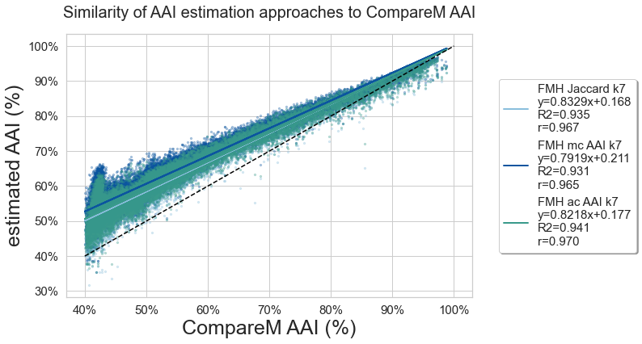

---
title: Protein k-mer analyses for assembly- and alignment-free sequence analysis
keywords:
- metagenomics
- AAI
- Alignment-free
- Assembly-free
- MinHash
- FracMinHash
- Containment
lang: en-US
date-meta: '2022-03-01'
author-meta:
- N. Tessa Pierce-Ward
- C. Titus Brown
header-includes: |-
  <!--
  Manubot generated metadata rendered from header-includes-template.html.
  Suggest improvements at https://github.com/manubot/manubot/blob/main/manubot/process/header-includes-template.html
  -->
  <meta name="dc.format" content="text/html" />
  <meta name="dc.title" content="Protein k-mer analyses for assembly- and alignment-free sequence analysis" />
  <meta name="citation_title" content="Protein k-mer analyses for assembly- and alignment-free sequence analysis" />
  <meta property="og:title" content="Protein k-mer analyses for assembly- and alignment-free sequence analysis" />
  <meta property="twitter:title" content="Protein k-mer analyses for assembly- and alignment-free sequence analysis" />
  <meta name="dc.date" content="2022-03-01" />
  <meta name="citation_publication_date" content="2022-03-01" />
  <meta name="dc.language" content="en-US" />
  <meta name="citation_language" content="en-US" />
  <meta name="dc.relation.ispartof" content="Manubot" />
  <meta name="dc.publisher" content="Manubot" />
  <meta name="citation_journal_title" content="Manubot" />
  <meta name="citation_technical_report_institution" content="Manubot" />
  <meta name="citation_author" content="N. Tessa Pierce-Ward" />
  <meta name="citation_author_institution" content="Department of Population Health and Reproduction, University of California, Davis" />
  <meta name="citation_author_orcid" content="0000-0002-2942-5331" />
  <meta name="twitter:creator" content="@saltyscientist" />
  <meta name="citation_author" content="C. Titus Brown" />
  <meta name="citation_author_institution" content="Department of Population Health and Reproduction, University of California, Davis" />
  <meta name="citation_author_orcid" content="0000-0001-6001-2677" />
  <meta name="twitter:creator" content="@ctitusbrown" />
  <link rel="canonical" href="https://bluegenes.github.io/2022-paper-protein-kmers/" />
  <meta property="og:url" content="https://bluegenes.github.io/2022-paper-protein-kmers/" />
  <meta property="twitter:url" content="https://bluegenes.github.io/2022-paper-protein-kmers/" />
  <meta name="citation_fulltext_html_url" content="https://bluegenes.github.io/2022-paper-protein-kmers/" />
  <meta name="citation_pdf_url" content="https://bluegenes.github.io/2022-paper-protein-kmers/manuscript.pdf" />
  <link rel="alternate" type="application/pdf" href="https://bluegenes.github.io/2022-paper-protein-kmers/manuscript.pdf" />
  <link rel="alternate" type="text/html" href="https://bluegenes.github.io/2022-paper-protein-kmers/v/1ee509c6404f4f58682866f02aeb9a233a85ba6f/" />
  <meta name="manubot_html_url_versioned" content="https://bluegenes.github.io/2022-paper-protein-kmers/v/1ee509c6404f4f58682866f02aeb9a233a85ba6f/" />
  <meta name="manubot_pdf_url_versioned" content="https://bluegenes.github.io/2022-paper-protein-kmers/v/1ee509c6404f4f58682866f02aeb9a233a85ba6f/manuscript.pdf" />
  <meta property="og:type" content="article" />
  <meta property="twitter:card" content="summary_large_image" />
  <link rel="icon" type="image/png" sizes="192x192" href="https://manubot.org/favicon-192x192.png" />
  <link rel="mask-icon" href="https://manubot.org/safari-pinned-tab.svg" color="#ad1457" />
  <meta name="theme-color" content="#ad1457" />
  <!-- end Manubot generated metadata -->
bibliography:
- content/manual-references.json
manubot-output-bibliography: output/references.json
manubot-output-citekeys: output/citations.tsv
manubot-requests-cache-path: ci/cache/requests-cache
manubot-clear-requests-cache: false
...

<small><em>
This manuscript
([permalink](https://bluegenes.github.io/2022-paper-protein-kmers/v/1ee509c6404f4f58682866f02aeb9a233a85ba6f/))
was automatically generated
from [bluegenes/2022-paper-protein-kmers@1ee509c](https://github.com/bluegenes/2022-paper-protein-kmers/tree/1ee509c6404f4f58682866f02aeb9a233a85ba6f)
on March 1, 2022.
</em></small>

## Authors

+ **N. Tessa Pierce-Ward** 
    {.inline_icon width=16 height=16}
    [0000-0002-2942-5331](https://orcid.org/0000-0002-2942-5331)
    · {.inline_icon width=16 height=16}
    [bluegenes](https://github.com/bluegenes)
    · {.inline_icon width=16 height=16}
    [saltyscientist](https://twitter.com/saltyscientist) 
  <small>
     Department of Population Health and Reproduction, University of California, Davis
     · Funded by NSF 1711984, NSF 2018911
  </small>

+ **C. Titus Brown** 
    {.inline_icon width=16 height=16}
    [0000-0001-6001-2677](https://orcid.org/0000-0001-6001-2677)
    · {.inline_icon width=16 height=16}
    [ctb](https://github.com/ctb)
    · {.inline_icon width=16 height=16}
    [ctitusbrown](https://twitter.com/ctitusbrown) 
  <small>
     Department of Population Health and Reproduction, University of California, Davis
     · Funded by Moore Foundation GBMF4551
  </small>

## Abstract {.page_break_before}

## Background

As the scale of genomic sequencing continues to grow, alignment-free methods for estimating sequence similarity have become critical for conducting tasks ranging from taxonomic classification to phylogenetic analysis on large-scale datasets [@doi:10.1186/s13059-016-0997-x; @doi:10.1186/gb-2014-15-3-r46].
The majority of alignment-free methods rely upon exact matching of k-mers: subsequences of length k, that can be counted and compared across datasets, with or without use of subsampling methods such as MinHash [] and derivates such as FracMinHash [@doi:10.1101/2022.01.11.475838].
As k-mer based methods rely on exact sequence matches, they can suffer from limited sensitivity when comparing highly polymorphic sequences or classifying organisms from groups that are not well represented in reference databases.

Current best practices methods can still only categorize a fraction of the metagenomic and metatranscriptomic data, especially for understudied and/or diverse habitats (xx% recovery for soil, xx% recovery ocean metagenomes, etc).
Even well-studied environments such as human gut can produce significant uncharacterized metagenome content.
"For example, a reference-based approach failed to map 35% of reads in the iHMP study on inflammatory bowel disease (Supp. Data. of (Franzosa et al., 2019)), omitting them from any further analysis.
These reads may belong to unknown microbes, phage or viruses, plasmids, or accessory elements of known microbes, all of which can
play a role in disease.[from RO1]".

To increase sensitivity of alignment-free methods, modified k-mer approaches have been introduced, including spaced seeds /split k-mers, which accommodate polymorphic sites in highly similar genomes (CITE).
For larger evolutionary distances, protein-based comparisons have long been the gold-standard approach for taxonomic and functional annotation, as protein sequence is more conserved than the underlying DNA sequence [@pubmed:2231712; @doi:10.1038/nmeth.3176].
As microbial and viral genomes are gene-dense, [MinHash-based] alignment-free comparisons of translated protein sequence have been shown to increase sensitivity for taxonomic classification and genome discovery [@doi:10.1038/ncomms11257; @doi:10.1186/s13059-019-1841-x].
Here, we demonstrate the utility of protein k-mer comparisons for phylogenomic reconstruction and taxonomic classification at larger evolutionary distances.
We use FracMinhash subsampling to facilitate conducting these comparisons at scale [@doi:10.1101/2022.01.11.475838].

FracMinHash is a MinHash variant for selecting and hashing a set of representative k-mers from a sequence dataset [@doi:10.1101/2022.01.11.475838]. Unlike traditional MinHash, FracMinHash sketches scale with the size of the dataset, meaning each sketch is comprised of the chosen proportion of k-mers in the input dataset, rather than a chosen number of k-mers.
Downsampling sequencing datasets in this way enables estimation of containment, which has been shown to permit more accurate estimation of genomic distance, particularly for genomes of very different lengths [@doi:10.1016/j.amc.2019.02.018; @doi:10.1186/s13059-019-1875-0].
Streaming containment estimates have been shown to facilitate genome discovery and correlate with Mash Distance, a proxy for Average Nucleotide Identity (ANI) [@doi:10.1186/s13059-019-1841-x; @doi:10.1186/s13059-020-02159-0].

Standardized genomic measures of relatedness such as ANI and its protein counterpart, Average Amino Acid Identity (AAI) have shown lasting utility for genome relatedness and phylogenomic analysis.
Traditional ANI and AAI describe the sequence similarity of all orthologous genes, either in nucleotide or protein space, respectively.
Both have been shown to be robust measures of overall pairwise genome relatedness even for highly incomplete datasets, such as those comprised of only ~4% of the genome or 100 genes [@doi:10.1128/AEM.01398-06; @doi:10.1038/ismej.2017.113].
ANI has emerged as the most widely-accepted method for estimating pairwise similarity of microbial genomes and delimiting species boundaries [@doi:10.1073/pnas.0906412106].
Recent research appears to confirm 95% ANI species threshold for prokaryotic species, although there is some debate as to the universality of this threshold [@doi:10.1038/s41467-018-07641-9; @doi:10.1128/mSystems.00731-19; @doi:10.1101/2020.07.27.223511].
AAI thresholds have been proposed for higher taxonomic ranks, <45%, 45-65% and 65-95% for family, genus, and species [@doi:10.1016/j.mib.2007.08.006; @doi:10.1038/ismej.2017.113].
While traditional alignment-based estimation of ANI and AAI are computationally intensive, sketching-based estimates and sketching-facilitated estimates have permitted ANI calculations at the scale of whole-databases [@doi:10.1186/s13059-016-0997-x; @doi:10.1186/s13059-019-1841-x; @doi:10.1038/s41467-018-07641-9].
Hera et. al (2022) [@doi:10.1101/2022.01.11.475870] introduced accurate nucleotide sequence distance estimation from FracMinHash containment estimates, while accounting for the non-independence of mutated k-mers [@doi:10.1101/2021.01.15.426881].

Here, we show that protein FracMinHash sketches can be used to find similarity across larger evolutionary distances than nucleotide k-mers. We demonstrate that FracMinHash Containment estimates can robustly estimate Average Amino Acid Identity across a range of evolutionary distances.
We then use FracMinHash comparison methods to tackle two classification challenges: taxonomic classification of assembled genomes, and compositional analysis of metagenomes.
Taken together, these results suggest that protein FracMinHash analyses can be used for metagenome sequence analysis, and may be particularly useful when sequenced organisms are more distantly related to organisms available in reference databases.

<!---
#### Notes

- AAI::phylogeny https://www.ncbi.nlm.nih.gov/pmc/articles/PMC1236649/
Unused
Alignment-based estimates can fail at larger evolutionary distances.
 rRNA amplicon surveys may underestimate bacterial diversity [@doi:10.1128/AEM.00014-18].

 , using genomes within the GTDB taxonomy as benchmarking test set.

We extend FracMinHash distance estimation to protein k-mers and demonstrate distance estimation across related genomes using the GTDB taxonomy.
FracMinHash containment estimates work well for genome pairs of varying lengths and for compositional analysis of metagenome samples.

FracMinHash sketches can be used for robust assembly and alignment-free pairwise relatedness estimation that can be used on sequences separated by a wide range of evolutionary distances.

Here, we demonstrate that the utility of FracMinHash protein containment, both used directly and a an approximation of ANI and AAI, for taxonomic classification and phylogenomic reconstruction for species across the tree of life.

--->

## Results

K-mer analysis methods enable similarity detection as low as a single shared k-mer between divergent genomes.
As a result, exact matching of long nucleotide k-mers can be used for taxonomic classification and similarity detection between closely related genomes, including strain-level, species-level, and genus-level comparisons (often using k-mer lengths 51, 31, and 21, respectively).
At larger evolutionary distances, accumulated nucleotide divergence limits the utility of exact nucleotide k-mer matching.
Protein sequences, which are more conserved than their corresponding nucleotide sequences, are the gold standard for comparisons at larger evolutionary distances.
Here, we evaluate the utility of amino acid k-mers for a wide range of genomic and metagenomic applications, including sequence distance estimation, taxonomic classification, and metagenome breakdown.

### Amino Acid k-mer length selection 

The Genome Taxonomy Database (GTDB) provides a genome-based taxonomy for bacterial and archaeal genomes [@doi:10.1038/s41587-020-0501-8]. 
We begin by assessing the prevalance of nucleotide amino acid k-mers of different k-mer lengths within genomes (/proteomes) selected for inclusion within GTDB.
The most recent GTDB release, `rs202`, encompasses 258,407 genomes from 47,895 species.

To make analyses at this scale tractable, we built `sourmash` FracMinHash sketches, with a scaling factor of 1000 for nucleotide k-mers (keep ~1/1000 k-mers) and 200 for amino acid k-mers (keep ~1/200 protein k-mers) [@doi:10.1101/2022.01.11.475838].
DNA FracMinHash sketches have been shown to accurately subsample genome datasets [@doi:10.1101/2022.01.11.475838].
For most genomes, both genomic and protein fastas were available for download from NCBI.
In remaining cases (n=36,632), genome fastas were translated into protein sequence via Prodigal [@doi:10.1186/1471-2105-11-119] prior to sketching.
We indexed these sketches into `sourmash` databases, which we have made available as part of the `Prepared Databases` section of the `sourmash` documentation, and archived on OSF [https://osf.io/t3fqa/] /Zenodo???.

For a range of nucleotide and amino acid k-mers lengths, we assessed the fraction of k-mers specific to each taxonomic rank.
For nucleotide k-mers, we used lengths of 21, 31, and 51, which are commonly used for analyses at the genus, species, and strain level, respectively. For amino acid k-mers, we focused on k-mer lengths ranging between k=7 and k=11, which roughly correspond to nucleotide k-mer lengths 21-31.
K-mers specific to a genome were only present in a single genome in the database; k-mers specific to a species were found in at least two genomes of the same species, etc. K-mers specific to a "superkingdom" were found in genomes from at least two phyla. 

For the GTDB-RS202 database, the majority of nucleotide k-mers are specific to (unique at) a specific genome, species, or genus. Few k-mers are shared across superkingdoms, though these do exist at a k-mer length of 21.
In contrast, all protein k-mer sizes contain a portion of k-mers that are shared across genera and above.
At a protein k-mer size of 7, over 80% of k-mers are present in genomes found in more than one phylum, while at a protein k-size of 10, the number of genome-specific k-mers is closer to that observed for nucleotide k-mers.
Given the difference in k-mers found across taxonomic ranks, we decided to focus on amino acid k-mer lengths 7 and 10 for our primary analyses.

This shared k-mers analysis is limited by the genomes included within GTDB. While some genera contain many thousands of genomes (e.g. 55k _Escherichia_ genomes), many others are limited to a single genome or pair of genomes. Thus here we do not consider the absolute numbers of shared k-mers, but rather the proportional differences between k-mer lengths.

<!---
NOTE: worth looking at k=17 /51???.
Also, go look at what ksizes are used in Mash Screen paper!!!
k=7 used by that db lookup paper (find)
--->

### Abridged GTDB Benchmarking Dataset

To rigorously assess the utility of protein k-mers for comparisons at an array of evolutionary distances, we selected a subset of GTDB genomes that would allow standardized comparisons across taxonomic ranks and overcome the database-inclusion limitations mentioned above.

For each genus with at least two species clusters in GTDB, one representative genome was randomly selected as an "anchor" genome.
Then, one additional genome was selected from the GTDB representative genomes matching the anchor's taxonomy at each higher taxonomic rank.
This "evolutionary path" consists of seven genomes: an anchor genome, a genome matching anchor taxonomy down to the genus level, one matching anchor taxonomy to the family level, one matching to the order level, and so on.
This creates a gradient of similarity, where comparisons to the anchor genome range from genus-level to superkingdom-level.

Path selection using the representative genomes in GTDB rs202 resulted in 4095 paths comprised of 9213 unique genomes (8790 Bacteria, 333 Archaea).
These paths include genome comparisons across 40 phyla (36 Bacteria, 4 Archaea), covering roughly a quarter of the 169 phyla (149 Bacteria, 20 Archaea) in GTDB release rs202.
While paths are limited to taxonomies with at least two GTDB representative genomes for each taxonomic rank, these paths provide a rich resource for comparisons at increasing evolutionary distances.

For DNA comparisons, each genome was sketched from the available genome downloaded from genbank.
For protein comparisons, we conducted two comparison workflows.
In both workflows, all anchor genomes were sketched from available proteomes (either downloaded or generated via Prodigal, as above).
For the first workflow, comparison proteomes were also sketched from the available proteome.
For these sketches, k-mer containment results are equally valid in both directions, so we report the mean containment for the comparison alongside the Jaccard Index.
For the second workflow, comparison genomes were 6-frame translated to build protein FracMinHash sketches.
As 6-frame translation introduces erroneous k-mers, we report only the containment estimate relative to the anchor proteome.
We term this "anchor containment", where the trusted genome is the "anchor" upon which we base the comparison.
We conduct k-mer comparisons using FracMinHash sketches default fractional scaling: 1/1000 k-mers from DNA sketches and 1/200 k-mers for protein sketches (including 6-frame translated sketches).
To verify results and estimate the impact of FracMinHash scaling, we also conduct comparisons using all available k-mers.

### Protein k-mers facilitate alignment-free comparisons at increased evolutionary distances

We begin by assessing k-mer statistics across the 6 comparisons (each genome compared with the anchor genome) within each of 4095 evolutionary paths.
When plotted by the rank of the lowest common ancestor, the dynamic range of containment values is much larger for protein k-mer comparisons.
While DNA k-mers can provide resolution at the genus level, log-transformed jaccard and containment values for protein k-mers continue to decrease, providing resolution for comparisons even between genomes in different phyla.
Average containment estimated from proteome sequence is very similar to anchor containment estimated from 6-frame translation of genome sequence, suggesting that either value can be used for this type of comparison.
We obtained similar results when comparing all available k-mers, suggesting that these results are not affected by FracMinHash scaling (_Supplemental Figure XX_).

**To do:**
- Containment instead of Jaccard, so can easily compare protein sketches vs 6-frame translated sketches 

**Questions:**
- Also display jaccard for protein sketch comparisons?
- Is there a better way to visualize this?
  - a pair of heatmaps?

### Distance estimation from FracMinHash sketch comparisons

DNA k-mer Jaccard has previously been used to estimate of the Average Nucleotide identity between genomes [cite Ondov Mash, Koslicki k-mer paper, Criscuolo?]. Recently, equations have been developed for FracMinHash Containment that estimate ANI while accounting for the nonindependence of mutated k-mers [@doi:10.1101/2022.01.11.475870].
These equations assume a simple mutational model and estimate distance solely based on k-mer statistics.
Here we apply FracMinHash distance estimation to protein k-mer comparisons to obtain an alignment-free estimate of Amino Acid Identity [@doi:10.1101/2022.01.11.475870].
As above, we utilize anchor containment for comparisons involving 6-frame translated sketches.

To assess whether k-mer methods can be used to approximate AAI, we compared our results with alignment-based methods that leverage three different algorithms: _EzAAIb (BLAST)_, EzAAIm (MMSeqs2), and CompareM (DIAMOND). _As BLAST-based alignment remains the gold-standard method, we compare all AAI values the BLAST AAI values._ 

{#fig:evolpathsAAIvsMMSeqs2 height=4in}

<!---
To do: 
- sketch translate:
  - comparison_genome vs anchor_proteome
     - Running: sketch translate comparison genome
     - Next: compare to anchor prot sketch
- ezAAI BLAST AAI if possible!
  - waiting on https://github.com/lebsnu/ezaai/issues/7
- plot vs blast AAI (replace MMSeqs2 plot)
- Show/use Jaccard for any reason?
"FracMinHash AAI values produced by Jaccard and Containment (here, average containment) methods are very similar."
--->
**add to figure: AAI from translated nucleotide --> reference protein anchor containment**

### Protein k-mer containment can be used for taxonomic classification

Given that protein k-mers facilitate similarity estimation across these larger evolutionary distances, we next assess the utility of protein k-mers for taxonomic assignment, both for metagenome breakdown/classification and for assembled genomes.

#### Metagenome breakdown using protein k-mers

As developed in Irber et al., 2022 [@doi:10.1101/2022.01.11.475838], minimum set cover of nucleotide k-mers can be used to find the set of genomes that cover all known k-mers in your metagenome.
This approach, implemented in `sourmash gather`, works by using k-mer containment relative to reference genomes ("anchor containment", as above) and "assigning" metagenome k-mers iteratively to the reference genome with highest containment.
Anchor containment is then re-estimated using the remaining unassigned query k-mers until all known k-mers have been assigned.
This step provides us with an ordered list of reference genomes, each of which represent a non-overlapping portion of the metagenome.
The taxonomy of these matched reference genomes thus represents the closest match for each of these non-overlapping portions of the metagenome.
In addition to reporting these exact matches, we can aggregate these taxonomic assignments of these  matches to obtain taxonomic summarization at each rank.

Here, we assess the utility of protein k-mers for this application using the same metagenome samples described in Irber et al., 2022 [@doi:10.1101/2022.01.11.475838].
As metagenome samples are unassembled, we use the 6-frame translation approach described above to obtain protein k-mers for comparison.
No modification to the min-set-cov approach is required, as it already relies upon anchor containment to the reference genomes.

**add figure: genome-grist mg breakdown, nucl k-mers, prot k-mers, nucl mapping**

_do we need an additional metagenome w/more divergent genomes, to show advantage of protein methods?_

<!---
to do:
  - [x] genome-grist gather paper metagenomes 
    - nucl space
    - prot space
    - compare recovery w/protein space
  - time comparison, gtdb-reps vs gtdb-all vs nucl genbank?
  - add more evolutionary distant metagenome?
  - compare the % of genome recovered with DNA, protein at diff ksizes.
  - DNA mapping vs prot k-mers
  - prot mapping vs prot k-mers
  - alt figure: genome-grist mg breakdown, prot k-mers, prot mapping

--->

#### Robust taxonomic classification from protein k-mers

We use a similar approach for taxonomic classification of assembled genomes from protein k-mer containment. 
We apply the same minimum set cover approach to find the set of reference genomes that cover all known k-mers in our sample (in this case, a genome itself rather than a metagenome).
If the most contained reference genome is sufficiently similar (passes default or user-defined threshold) to our query, we can annotate the query with taxonomic information from this reference genome. 
If not, we can use the genome-based lowest common ancestor approach to classify the query genome to the taxonomic rank where it contains sufficient similarity to matched reference genome sequence. 

We select two sets of genomes: first, a set of 1000 genomes from the MGNify project ("MGNify-1000"), which are assembled from human gut and likely to be well-represented in existing databases.
We next choose a set of 885 microbial ("Delmont-885"; 820 _Bacteria_, 65 _Archaea_) metagenome-assembled genomes (MAGs) assembled from TARA Oceans metagenomes [@doi:10.1038/s41564-018-0176-9].
As the marine environment is understudied relative to human gut, these genomes are more challenging for classifiers as they are less likely to have close relatives available in reference databases.

To assess the utility of protein k-mers for genome classification, we conduct this classification using three k-mer approaches: direct nucleotide k-mers, 6-frame translated protein k-mers, and direct protein k-mers from prodigal-translated proteomes. Where reference taxnonomic lineages were available (MGNify-1000), we compared our results directly to these annotations. With experimental genomes where no reference taxonomic lineage is available, we assessed our annotation relative to `gtdb-tk` classification [@doi:10.1093/bioinformatics/btz848].

| Dataset  | Exact Match | Higher Rank| Unclassified (sourmash) | Unclassified (GTDB-Tk) |
|:-----------|------:|-------:|----------:|----------:|
| MGNify-1000| 95.7% | 4.3%   | N/A  | N/A |
| Delmont-885    | 73.5% | 26.5%  | 1 (0.1%) | 15 (1.7%) |

<!---
to do:
- finish gather for MGNify, Delmont sets
- comparisons, k7, k10 vs gtdb-classify
- gtdb-all vs gtdb-reps (time, accuracy)
- add results for nucl vs 6-frame vs direct protein!
- text: explain min-set-cov <-> containment
--->

<!---
For , e.g. Pseudomonas, XX% of k-mers are 	shared within the chosen/published genomes within species. For all published genomes within the genus, a median of xx% of k-mers are shared between genomes of one species and genomes of the a different species in the same genus.

== median or mean containment at rank?
containent = % of a genome's k-mers that are shared
-- do using ALL of gtdb, BUT, start with just a single set of genomes.. e.g. Pseudomonas? == similar to "shared k-mers" paper [@doi:10.24072/pci.genomics.100001]

{#fig:evolpathsContain}
--->

<!---
### Lost Bits

** gtdb evolpaths (all k-mers)**
As the number of genomes per taxon varies widely across GTDB, comparisons across the entire GTDB database may be impacted by the particular genomes included in the database.
To minimize any database biases, we developed a randomized subset of the GTDB database to assess the utility of protein k-mers across a wide range of evolutionary distances.

[GTDB] This database provides a wide array of genomes for assessing the utility of protein k-mers for bacterial and archaeal similarity estimation and taxonomic classification.
Long dna k-mers ~~ short protein k-mers

while shorter dna k-mers might be shared across more sequence, you increase the risk for result in"shared, non-homologous k-mers" (k-mer homoplasy). A protein k-mer of length `10` coverse 30 base pairs in of nucleotide sequence 
Long nucleotide k-mers have already been shown to be useful for comparing genomes within the same genus or species.
For all DNA k-mer sizes, the majority of k-mers are present in only a single species, with only a few k-mers shared across genera.
Only at a dna k-mer size of 21 are a significant fraction of k-mers present in genomes shared across different families or even phyla.

{#fig:evolpathsANIAAI}

<!---
**For Evolpaths: WHY no multi-species representatives?**

{#fig:evolpathsAAIvsCompareM height=2in}

_We have generalized this type of comparison as the "maximum containment", which is the containment relative to the smaller set of k-mers. Since 6-frame translation should always yield excess k-mers relative to genomes of similar size, max containment will generally provide AAI comparisons of 6-frame translated k-mers to reference proteomes._
Since 6-frame translation should always yield excess k-mers relative to genomes of similar size, max containment will generally provide AAI comparisons of 6-frame translated k-mers to reference proteomes._

Anchor containment can also be used to enable robust taxonomic classification from either assembled proteomes or 6-frame translated DNA queries.

As implemented in `sourmash gather` [@doi:10.1101/2022.01.11.475838], this step provides us with a list of reference genomes in order of highest k-mer containment by our query.
Jaccard ...(number of k-mers shared between two samples divided by the total number of k-mers across both samples) and the Containment index ()from FracMinHash sketches.
--->

## Discussion

_just some disjoint notes, at the moment :)_

K-mer based estimation of sequence identity has been limited to nucleotide sequences of similar size with high sequence identity (>80%),outside of which MinHash Jaccard is less well correlated with sequence identity [@doi:10.1186/s13059-016-0997-x; @doi:10.1038/s41467-018-07641-9].

### Shared k-mers

 K-mers shared at such a high level may be indicative of true shared biological sequence, contamination, or k-mer homoplasy: the presence of k-mers that are identical by chance rather than evolutionary descent. ](images/gtdb-rs202.lca_f_aggregated_kmers.png){#fig:gtdb-kmers height=2in}

The differences observed between nucleotide and amino acid k-mers, as well as across different k-mer lengths suggests that these different k-mer sizes may provide resolution at different taxonomic ranks. The exact characterization here is of course impacted by which are genomes included in the database, but we are confident that the 258k genomes included within GTDB provide a good testing ground for this assessment.

<!---
**We chose to assess k=10 and k=7, because these ksies mostly closely correspond to nucleotide k-mer 21, 31. k7 has also been previously used for database lookup (find paper + reference), but we didn't want to exclusively use it because so many 7-mers are shared across phyla. ** 

note 31, 51 --- maybe partially a result of database issues, e.g. not all species have multiple members; sometimes all members are closely related.

--->

By leveraging the Containment Index of FracMinHash sketches with both nucleotide and protein k-mers, we can extend accurate k-mer sequence identity to sequences of different sizes and to >50% Amino Acid Identity.

Cricuolo [@doi:10.12688/f1000research.26930.1] (suggests w/ appropriate correction, nucl MinHash Jaccard can be used up to >65% ANI??)

Here, we utilize FracMinHash sketches with Containment to overcome size differences between sequences being compared. 

To accurately estimate sequence identity from sequence files of different sizes(genomes, metagenomes, etc), we employ FracMinhash sketches, which enables estimation of the Containment Index. 

At k=21 (dna) and k=7 (protein), many k	-mers are shared across taxonomic groups.

While this method is still dependent on a good set of reference genomes, updating the set of references with new data does not require recalculation of discriminatory k=mer sets...

** discussion of k-mer size **

- FracMinhash distance estimation is robust to completeness
(unlike standard minhash https://drep.readthedocs.io/en/latest/choosing_parameters.html#importance-of-genome-completeness)

**Containment enables comparison directly from DNA sequence**

**containment** is imp:
Assembly methods can exclude up to XX% of data.

Unlike Jaccard comparisons, which estimate the similarity between sets, containment estimates are relative to each individual set. 
When one set is highly trusted, such as a reference genome or proteome, the containment relative to that set may be most informative.
In these cases, we can consider the trusted genome as an "anchor" upon which we are basing our comparison, and the containment relative to this set as "anchor containment."

### Maximum Containment

For both 6-frame translation and metagenome breakdown comparisons, the most informative containment value will be relative to the smaller set of k-mers (typically reference proteomes), rather than relative to all metagenome k-mers or all 6-frame translated genome or metagenome k-mers. As such, we have implemented "maximum containment," a shorthand method to always select the greater of the two containment values for AAI estimation. Maximum containment method may also provide advantages for genomes with potential contamination, as containment will always be relative to the smaller, and presumably less contaminated, genome. However, highly incomplete genomes may overestimate AAI with this method, so we suggest using containment relative to the more trusted sample if known, or using average containment AAI or jaccard AAI when comparing two genomes of approximately equal quality.

**While eukaryotic datasets are out of scope of this paper, these methods should work fine (except repeats/indels) -- discuss a bit and/or do some analyses**

For the 6-frame translated comparisons, only ~1/6th of the k-mers generated by 6-frame translation will belong to true ORFs.

For protein k-mer comparisons to be useful, any DNA queries must be translated into protein sequence. Often this limits amino acid comparisons to assembly-based workflows, as assemblies can be reliably translated into predicted Open Reading Frames (ORFs).
With k-mer methods, we can utilize direct 6-frame translation, which is assembly-free but does not attempt to find the correct open reading frame.
Assuming a single open reading frame, only ~1/6th of the k-mers generated by 6-frame translation will belong to true ORFs.
The remaining erroneous k-mers greatly impact the Jaccard Index (set similarity) when comparing samples.
However, these k-mers only impact the containment index in one direction (relative to the set with erroneous k-mers)
By using only the FracMinHash containment estimate relative to reference proteomes, we can obtain accurate Amino Acid Identity estimates directly from DNA sequence.
_We term this "anchor" containment, where the trusted genome is the "anchor" upon which we base the comparison._
Since 6-frame translation should always yield excess k-mers relative to genomes of similar size, this desired containment will generally be the larger of the two containment values (maximum containment).
Note that comparing two 6-frame translated datasets is not recommended, as there is no mechanism to exclude erroneous k-mers introduced during translation.

**by using only the FracMinHash containment estimate relative to reference proteomes, we can obtain accurate Amino Acid Identity estimates directly from DNA sequence.**

evolpath containment values --driven by the k-mer frequency patterns observed in gtdb db...

<!---
A number of methods have used discriminatory k-mer analysis for taxonomic classification. However, most rely upon first developing a reference of discriminatory k-mers, e.g. k-mers unique to / diagnostic of a taxonomic group.
Instead, sourmash gather leverages the Containment Index to find the reference match that shares the largest number of k-mers with the query sequence.

Unlike many k-mer based classifiers, we do not need to explicitly characterize the discriminatory k-mers for each taxonomic group.
The Containment Index uses all matched k-mers between the query and each reference, finding the % of each reference genome present in the query.
Gather then selects the most covered (highest percent contained) reference genome, thus utilizing the combination of shared and discriminatory k-mers to find the most parsimonious match.
After finding the best match, all matched k-mers are removed for the query in order to repeat the analysis to find the next most parsimonious genome match.

FracMinHash sketches enable estimation of the Containment Index in addition to the more commonly used Jaccard Index. Unlike Jaccard comparisons, which estimate the similarity between sets, containment estimates are relative to each individual set. When both proteomes are equally trusted, the directional containment can be averaged, as done for BLAST-based AAI's(CITE?), which can differ depending on the direction of alignment. In contrast, when one set is highly trusted, such as a reference genome or proteome, the containment relative to that set may be most informative. 

--->

## Conclusions

Containment-based pairwise distance estimation via Scaled Minhash enables accurate assembly-free and alignment-free phylogenomic reconstruction and taxonomic classification across a wide range of evolutionary distances.

## Methods

### FracMinHash Sketching with Sourmash

As implemented in sourmash [@doi:10.1101/2022.01.11.475838; @doi:10.12688/f1000research.19675.1; @doi:10.21105/joss.00027], FracMinHash is a MinHash variant that uses a scaling factor to subsample the unique k-mers in the dataset to the chosen proportion (1/`scaled`).
As k-mers are randomized prior to systematic subsampling, FracMinHash sketches are representative subsets that can be used for comparisons, as long as the k-mer size and chosen scaled value remain consistent. 
Unlike traditional MinHash sketches, FracMinHash sketches enable similarity estimation with containment, which permits more accurate estimation of genomic distance when genomes or datasets differ in size [@doi:10.1016/j.amc.2019.02.018;@doi:10.1186/s13059-019-1875-0]. 

Sourmash v4.x supports sketching from either nucleotide or protein input sequence.
All genome sequences were sketched with sourmash v4.2.1 using the `sourmash sketch dna` command, k-mer sizes of 21,31,51, a scaling factor of 1000. 
Sourmash also supports 6-frame translation of nucleotide sequence to amino acid sequence.
To assess the utility of these translated sketches, genome sequences were also sketched with the `sourmash sketch translate` command at protein k-sizes (_kaa-mer sizes?_) of 7-12 and a scaling factor of 200. 
All proteome sequences were sketched with sourmash >=v4.2.1 using the `sourmash sketch protein` command at protein k-sizes (_kaa-mer sizes?_) of 7-12 and a scaling factor of 100.

### Sequence Identity Estimation from FracMinHash
_(very DRAFTy)_

Sourmash contains standard implementations of Jaccard Index [@doi:10.1186/s13059-016-0997-x] and Containment Index [@doi:10.1016/j.amc.2019.02.018] set comparisons.

**Estimating Sequence Similarity from Jaccard**
For a comparison between two genomes (genomeA, genomeB), the Jaccard Index represents the k-mers shared between the two genomes (sketch intersection) divided by the k-mers present in both sketches (sketch union).
Thus the Jaccard Index represents the percent of shared k-mers relative to all k-mers across both genomes (intersection/genomeA+genomeB).
MinHash Sketch Jaccard has been shown to correlate well with ANI at high sequence identities (>=90% sequence identity) [@doi:10.1186/s13059-016-0997-x]; (>=80% sequence identity [@doi:10.1038/s41467-018-07641-9].

_discuss MRCC jaccard_

**Estimating Sequence Similarity from Containment**
As the Jaccard Index utilizes the union of all k-mers in a dataset, it is greatly affected by differences in dataset size [@doi:10.1093/bib/bbz083].
The Containment Index instead represents the percent of a genome found in the comparison genome.
Containment is directional: while the number of shared k-mers is fixed for a pairwise comparison, the Containment of each dataset will depend on the unique k-mers found in that particular dataset. Containment for genomeA will be (intersection/genomeA), while Containment for genomeB will be (intersection/genomeB).

Alignment-based ANI/AAI represents the sequence similarity of the alignable fraction of two genomes. In this way, ANI/AAI only compares the shared sequences, and discounts/ignores all other sequence present in either genome.
Bidirectional containment comparisons use the same numerator (shared k-mers), but may contain different numbers of non-shared k-mers in the denominator.

In cases where both genomes are high-quality and highly complete, we can most closely approximate ANI by using the maximum value between the bidirectional containment values: that is, using the comparison that represents the shared sequence over the genome with the smallest number of non-shared k-mers.

In cases where one genome is more trusted (high quality and highly complete), Containment may be best calculated relative to the trusted genome.
This use case also allows us to estimate sequence identity from larger sequence collections, such as metagenomes.
By definition, metagenomes contain k-mers from many organisms.
We can take advantage of directional Containment by calculating the Containment Index of Reference genomes that share many k-mers with the Metagenome.
We have already shown the utility of Containment for metagenome classification [@https://dib-lab.github.io/2020-paper-sourmash-gather], but now we can report estimated average sequence identity between the matching sequence regions and the reference genome.

**Estimating Sequence Identity from FracMinHash**

**_TBD_**

Blanca et al, 2021 [@doi:10.1101/2021.01.15.426881] presented a method to estimate the mutation rate between MinHash sketches while accounting for the non-independence of mutated k-mers. Using [@https://github.com/KoslickiLab/mutation-rate-ci-calculator], we estimate Sequence Identity from FracMinHash Containment.

discuss HLL / bias factor?

### FracMinHash Distance Correlates with Standard Methods

FastANI v1.32 ([@doi:10.1038/s41467-018-07641-9]; run with default parameters)  was used to obtain Average Nucleotide Identity between the anchor genome and each additional genome in its evolutionary path.
FastANI is targeted at ANI values between 80%-100%, so only values in this range are considered "trusted" and used in **assessing the correlation between FracMinHash estimates and FastANI._(TBD)_**

CompareM v0.1.2 ([@url:https://github.com/dparks1134/CompareM]; run with `--sensitive` parameter for DIAMOND mapping) was used to obtain Average Amino Acid Identity between the anchor proteome and each additional proteome in its evolutionary path.
CompareM reports the mean and standard deviation of AAI, as well as the fraction of orthologous genes upon which this estimate is based.
Briefly, CompareM calls genes for each genome or proteome using PRODIGAL [@doi:10.1038/nmeth.3176] and conducts reciprocal best-hit mapping via DIAMOND [@doi:10.1186/1471-2105-11-119].
By default, CompareM requires at least 30% percent sequence identity and 70% percent alignment length to identify orthologous genes.
As DIAMOND alignment-based homology identification may correlate less well with BLAST-based homology under 60% sequence identity [@url:https://rodriguez-r.com/blog/aai-blast-vs-diamond/], **we also ran compareM with a percent sequence identity threshold of 60% to obtain a set of high-confidence orthologous genes for AAI estimation. We report correlation between FracMinHash AAI estimation and each of these compareM parameter sets in XX _(TBD)_**. _CompareM was also used to obtain AAI values directly from each genome, using PRODIGAL to translate sequences prior to gene calling. These results [were not significantly different from proteome-based AAI estimation??] (Supplemental XX)._

### Taxonomic Classification with Sourmash `Gather` and `Taxonomy`

To take advantage of the increased evolutionary distance comparisons offered by protein k-mers, we apply compositional analysis with sourmash gather [@https://dib-lab.github.io/2020-paper-sourmash-gather] to protein sequences (amino acid input and 6-frame translation from nucleotides).
Sourmash gather is conducted in two parts: 
First (preselection), gather searches the query against all reference genomes, building all genomes with matches into a smaller, in-memory database for use in step 2.
Second (decomposition), gather does iterative best-containment decomposition, where query k-mers are iteratively assigned to the reference genome with best containment match.
In this way, gather reports the minimal list of reference genomes that contain all of the k-mers that matched any reference in the database.

For reference matches with high sequence identity (ANI) to the query, we classify the query sequence as a member of the reference taxonomic group, as in [@https://dib-lab.github.io/2020-paper-sourmash-gather].
**However, when ANI between the query and the top reference match exceeds the taxonomic rank threshold (e.g. species default 95%), we use a least/lowest common ancestor (LCA) approach to report likely taxonomy at a higher taxonomic rank _(TBD)_**.
Briefly, as gather reports non-overlapping genome matches, we can sum the k-mer matches for all genomes with shared taxonomies at the next higher taxonomic rank to report the best query containment at that rank.
As this gather-LCA approach first uniquely assigns k-mers to their best reference genome, it bypasses the impact of increasing database size on taxonomic assignment observed for other LCA-based k-mer classification approaches [@doi:10.1186/s13059-018-1554-6].

Taxonomic utilities are implemented in the `sourmash taxonomy` module.

### Workflows and Computing Resources

Reproducible workflows associated with this paper are available at XX (gh link + doi for release), with datasets available at OSF (XX). All workflows were executed using snakemake >= 5.26 [@doi:10.12688/f1000research.29032.1)] on the FARM cluster at UC Davis, using practices outlined in [@doi:10.1093/gigascience/giaa140].

## Supplemental

### Protein k-mers facilitate alignment-free comparisons at increased evolutionary distances

{#fig:evolpathsAAIvsCompareM height=2in}

## References {.page_break_before}

<!-- Explicitly insert bibliography here -->

